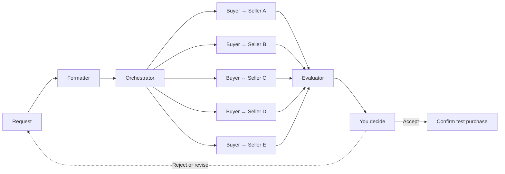

<p align="center">
  
</p>

<p align="center">
  <strong>Turn Your Need into a Deal</strong>
</p>

<p align="center">
  
  
  
  
</p>

<p align="center">
  <a href="#quick-start"><strong>Quick start</strong></a>
  |
  <a href="#how-it-works"><strong>How it works</strong></a>
  |
  <a href="#documentation"><strong>Documentation</strong></a>
</p>

**1st Place - Sea x OpenAI Regional Codex Hackathon Taiwan.**

TurnDeal is an agent-to-agent commerce platform that turns a buyer's intent into a negotiated, validated set of deals. A buyer describes what they need, their budget, and their constraints; TurnDeal formats that request, privately negotiates with multiple Seller Agents, validates every returned offer, and helps the buyer choose the best deal without giving up control.

The product is built around a simple principle: agents can negotiate, but the buyer decides. Sponsored placement never affects recommendation ranking, accepting an offer does not purchase it, and paid add-ons require explicit permission.

## How It Works



## Highlights

- Private, parallel negotiation with up to five Seller Agents.
- Structured request formatting from free-form buyer intent, budget, and delivery constraints.
- Backend validation for inventory, price, delivery, terms, expiry, benefits, and paid add-on permission.
- Independent evaluation across the complete eligible offer set, separate from campaign or sponsored data.
- Buyer profiles, weighted preferences, model selection, clarification, and versioned request improvement.
- Desktop and mobile-first flows, including an ACP test checkout with simulated payment.
- Deterministic offline mode with bounded model fallbacks for demos and development.

## Quick Start

Requires Node.js 24.

```powershell
git clone https://github.com/muen1019/TurnDeal.git
cd TurnDeal
npm ci
npm --prefix backend ci
npm --prefix frontend ci
npm run dev
```

Open <http://127.0.0.1:5173/chat> and enter:

```text
I need a wireless mouse under 1000 TWD, preferably quiet, with fast delivery.
```


`npm run dev` is fully offline. It still executes formatter rules, discovery, Seller negotiation, evaluator fallback, SQLite persistence, clarification, request improvement, and simulated checkout.

To enable supported models with a server-side key:

```powershell
npm run dev:secure
```

The launcher reads the key through a hidden terminal prompt. It does not write the key to a file or pass it into the frontend environment.

## Mobile Demo

```powershell
npm run dev:mobile
```

This starts the isolated offline mobile flow with an in-memory SQLite database. `npm run dev:mobile:secure` enables the paired live-model development flow. Both are development-only services for trusted local networks; use fictional profile and address data.

See [mobile UI](docs/MOBILE_UI.md) and [mobile live mode](docs/MOBILE_LIVE.md).

## Safety Boundaries

- Seller and model output is untrusted; the backend creates immutable offer IDs and eligibility.
- Each Seller sees only its own RFQ, policy, history, and de-identified comparable terms.
- Campaign data never enters evaluator input or natural ranking.
- A paid add-on requires explicit user permission.
- Every POST uses an idempotency key and every resource is buyer-scoped.
- Request documents, published snapshots, offers, and committed rounds remain immutable.
- Accepting, improving, and purchasing are separate operations. Test checkout never performs real payment or shipping.
- SQLite is authoritative; browser drafts and agent memory are not.

## Repository

| Path | Purpose |
| --- | --- |
| `backend/runtime/` | Node 24 integrated API and mobile runtime |
| `backend/src/` | Node 20 legacy Result server and shared modules |
| `frontend/` | React and Vite application |
| `src/` | Formatter, Orchestrator, Negotiation, and Evaluator core |
| `contracts/` | JSON Schema, model output schemas, and fixtures |
| `db/migrations/` | Authoritative SQLite schema |
| `docs/` | Current architecture and operating documentation |

Internal `offermesh` package names and `OFFERMESH_*` variables remain compatibility identifiers. The product and repository name is TurnDeal.

## Documentation

- [Documentation index](docs/README.md)
- [Run the full app](docs/RUN_FULL_APP.md)
- [System design](docs/SYSTEM_DESIGN.md)
- [Buyer setup](docs/BUYER_SETUP.md)
- [Intent and preference semantics](docs/INTENT_PREFERENCE_SPEC.md)
- [Contracts](contracts/README.md)
- [Database](db/README.md)
- [Testing](docs/TESTING.md)

## Verification

```powershell
npm test
npm --prefix frontend test
npm --prefix frontend run build
```

See [testing](docs/TESTING.md) for focused and browser suites. Generated reports, logs, screenshots, runtime databases, and local test output are not committed.

## Hackathon Scope

TurnDeal was built for the Sea x OpenAI Regional Codex Hackathon Taiwan and won 1st place. The hackathon implementation includes contracts, migrations, request formatting, 120 synthetic listings, Seller policies, five-branch negotiation, offer validation, independent evaluation, buyer setup, clarification, Result UI, versioned request improvement, mobile flows, and ACP test checkout.

The MVP focuses on one wireless mouse and at most one related mouse pad. Seller, price, cost, rating, benefit, and fulfillment data are synthetic demo data.

## Sources

The app uses React, Vite, Express, sql.js, Ajv, Playwright, and other OSS pinned by package lockfiles. Specification workflow uses [OpenSpec](https://github.com/Fission-AI/OpenSpec). The fixed ACP upstream version and license are recorded in `contracts/acp/`; Taiwan address reference attribution is in `frontend/src/reference/TAIWAN_ADDRESS_LICENSE.md`.
