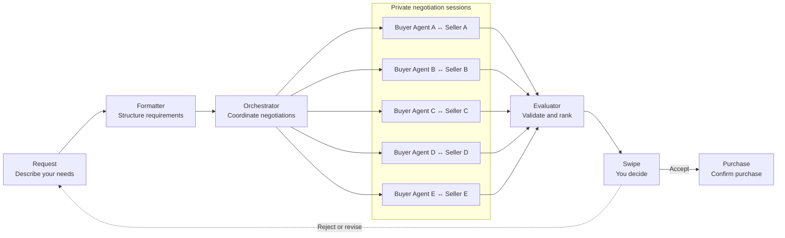

# TurnDeal

> Turn Your Need into a Deal

**The negotiation layer owned by the platform.**

TurnDeal is the platform-owned negotiation layer for agent-to-agent (A2A) commerce.

Tell TurnDeal what you want to buy, your budget, and your requirements. It negotiates privately with multiple candidate Seller Agents, filters out offers that do not meet your needs, and presents the options worth considering.

You always make the final decision. TurnDeal accelerates transactions between buyers, sellers, and marketplaces—creating a win for all three.

## How it works



## What makes TurnDeal different

- **Parallel negotiation** — Multiple Buyer Agents negotiate with Sellers independently, so you do not have to compare stores one by one.
- **Private competition** — Sellers cannot access other sellers' identities, offers, or private strategies.
- **Independent evaluation** — The Evaluator only compares valid offers that meet your budget, product, and delivery requirements.
- **No pay-to-win recommendations** — Sponsored placement does not affect ranking, and AI never purchases without your approval.
- **Learns what matters to you** — Your preferences and rejection reasons can inform the next request and improve future results.

## Try the demo

Requires Node.js 24 or later.

```powershell
git clone https://github.com/muen1019/sea-hackathon.git
cd sea-hackathon

npm ci
npm --prefix backend ci
npm --prefix frontend ci
npm run dev
```
