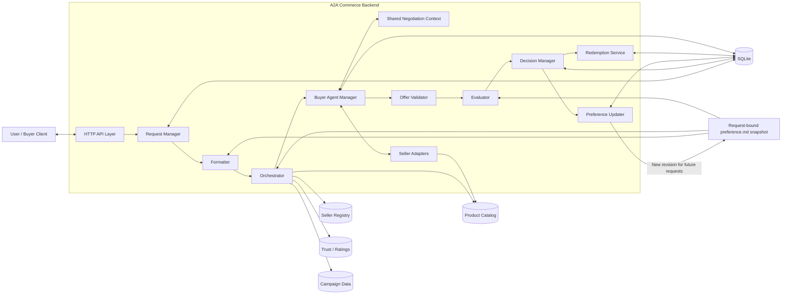
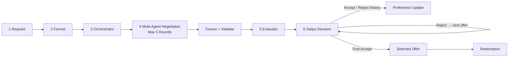
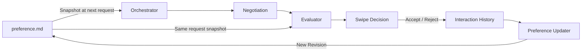
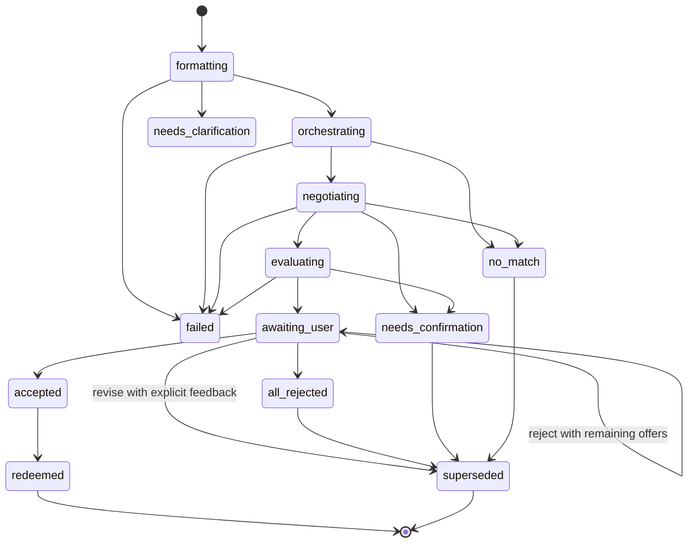
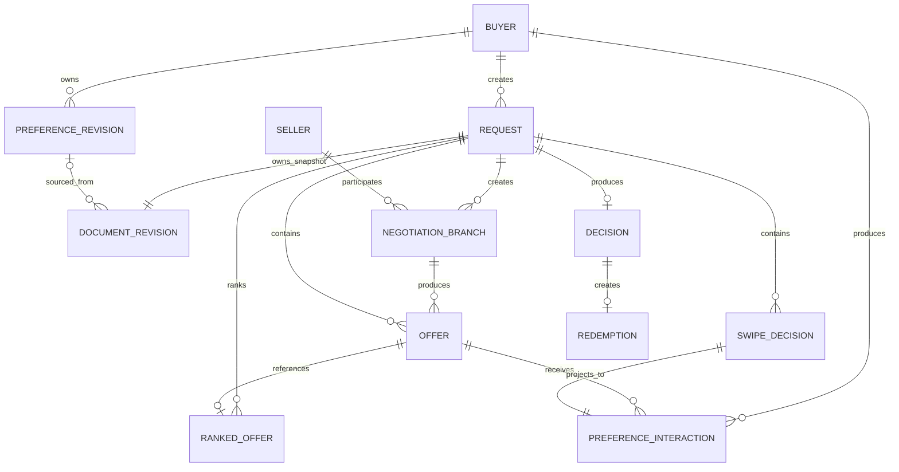
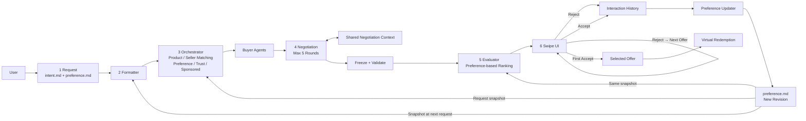

> 現行 Result API 已統一 v0.3；accept/reject 與資料庫遷移見 [統一契約](UNIFIED_RESULT_CONTRACT.md)。本文其餘完整 Agent pipeline 屬目標設計。

> 文件定位：目標系統設計；五家 Seller／最多五輪已遷移至 v0.3 JSON Schema／fixtures，其餘差異如下。
>
> 來源：[HackMD 設計文件](https://hackmd.io/uVLaU-wzQJueJDNmEf51PQ?both)；來源最後更新：2026-09-12T03:26:00.107Z；匯入日期：2026-09-12。
>
> 此檔以 HackMD 匯入快照為基礎，沒有自動雙向同步。2026-09-12 本地 spec 更新：Orchestrator 選出五家 Seller，各派一個 Buyer Agent，每次議價最多五輪；合格 Seller 不足五家時依實際數量進行。此更新尚未同步回 HackMD。

## Repo 整合狀態

目前契約與驗收以 [v0.3 schema](../contracts/a2a-commerce.v0.3.schema.json)、[開發規則](DEVELOPMENT_RULES.md) 與 [AGENTS.md](../AGENTS.md) 為準。v0.2 已同步五家 Seller、五輪上限、is_final／stop_reason、fixtures、驗證器及 SQLite migration。完整 Backend pipeline 與同步排程器尚未實作；第 9 節其餘 TypeScript 與 JSON 草案仍不是現有 API 已支援的宣告。

| 主題 | Repo v0.2 基準 | 本文目標／剩餘遷移範圍 |
| --- | --- | --- |
| Seller 名單 | 五家測資；OrchestrationResult／RequestSnapshot 的 seller_agents 最多五家，驗證 ID 唯一與 listing_rank 連續 | 依自然排序選前五家合格 Seller，各派一個 Buyer Agent；不足五家依實際數量。實際 discovery／派發服務仍待實作 |
| 議價輪次 | 共用 NegotiationRound 為 1～5；SellerRound／SellerNegotiationResult 有 is_final，SellerAgent 有 Backend stop_reason；測資示範提前退出 | 同步 barrier、round timeout 與停止後不再派發由後續排程器落實；本版驗證 recorded trace，不宣稱已有 live scheduler |
| 資訊共享 | 不向 Seller 披露其他 Seller 報價 | Buyer 共享已驗證 context，Seller 只取得可比較的去識別化條件；須同步變更隱私規則與 RFQ 測試 |
| 決策 | reject + feedback 建立 child | reject 處理目前 Offer；revise + feedback 建立 child；更新 RejectDecision／DecisionResult |
| Swipe 狀態 | 沒有逐張 DecisionSession 或 all_rejected | 新增 session、current_offer_id、互動事件與 all_rejected；更新 RequestSnapshot／Status |
| 偏好來源 | ProductPreference 沒有 source；交易偏好為字串 | explicit／behavioral 分層，有來源的交易偏好與證據，更新 Formatter／Evaluator input |
| 文件版本 | DocumentBundle 的 Request revision | 另增長期 preference_revision_id 與背景更新紀錄；新版本不改既有 Request 快照 |
| 時間預算 | 五輪上限；時間／成本停止原因可記錄，實際 timeout／deadline 數值待 Backend 量測與設定 | 五輪上限、round timeout、global deadline 與成本限制；舊版 8 秒不作五輪完成承諾 |
| Evaluator 失敗 | 必須提供 deterministic fallback | 本文規劃 invalid／unavailable 進 failed；這項差異尚待取捨，現行 v0.2 繼續遵守 fallback 規則 |
| 持久化與恢復 | 已有 SQLite migration、seed、完整性檢查及 feedback_events／user_preferences 資料表；尚未完成完整 Backend pipeline | 須在既有資料庫基礎上補齊 Shared Context revisions、DecisionSession、偏好更新工作與中斷恢復，並對齊新版 Swipe 語意 |

後續契約遷移仍應以獨立升版變更，同步 schema、fixtures、驗證器、受影響 consumer 及共同規則，經專案既定 review 流程後合併。不要直接拿本文件尚未遷移的 payload 傳給 v0.2 consumer。文件中的錯誤狀態、fallback 與跨 Seller 資訊邊界亦須一併對齊。

合併 main 時已保留新增的 Marketplace 公開來源快照與 SQLite 實作，見 [資料來源政策](../contracts/fixtures/MARKETPLACE_DATA.md) 與 [資料庫說明](../db/README.md)。目前資料庫的有原因回饋仍採建立 child 的 v0.1 語意；本文件的 reject／revise 分離尚需遷移。

原文引用的完整 REFERENCE.md 尚未取得；[來源待補清單](REFERENCE.md) 保留原編號與引用位置，未補上來源前不能視為已核實的參考文獻。

---

# A2A Commerce：六階段議價、排序與方案採用設計

> **Request → Format → Orchestrator → Negotiate → Evaluate → Result / Feedback Loop**

**狀態：尚未實作的 HLD 與 API 契約草案。** 本版依第 2.3 節六步驟編排第 3～8 節；第 9 節集中定義最小 API 與 payload schema。編號方案先在虛擬市場兌換，真實付款／ACP 仍延後。來源與適用限制見 [REFERENCE.md](REFERENCE.md)。

<a id="overview"></a>

## 1. 目標與範圍

Buyer Agent 帶著 `intent.md` 與選填 `preference.md` 提出需求。系統羅列相關商家、安排贊助曝光並平行議價，Evaluator 將優惠組合排序後交給使用者。使用者依固定排序逐張 Reject／Accept，第一個 Accept 成為 selected_offer；明確提出 revise 才更新需求並重跑。長期互動可更新後續 Request 使用的軟偏好。

| 本版做什麼 | 最小實作 |
| --- | --- |
| 商品與 Seller | 滑鼠、滑鼠墊；五家固定登錄商家與本地商品／政策資料 |
| Orchestrator | 依商品匹配與信任等自然排序列出五家合格 Seller，不足時列出實際數量；每家各派一個 Buyer Agent，另有獨立 Sponsored 位置 |
| Negotiate / Evaluate | 每家最多五輪同步議價、共享競爭報價、單買與搭售方案；獨立 Agent 輸出排序，不替使用者決定購買 |
| Result loop | 逐張 Swipe、First Accept、all_rejected；revise 建立 child request；行為更新未來偏好 |
| 方案兌換 | 使用不可變 offer_id，在期限內於虛擬市場一次性套用 |
| 執行與儲存 | 一個常駐後端、四個 HTTP endpoints、SQLite 保存工作／文件版本／議價 context／互動／採用與兌換紀錄 |

SQLite 用於讓文件迭代與兌換狀態跨重啟保留；不引入 Redis、訊息佇列或微服務。廣告只模擬曝光選擇，沒有計費。情境優惠背景見 [REF-12](REFERENCE.md#ref-12)。

<a id="architecture"></a>

## 2. System Design

本節整合 Buyer 提供的系統設計；第 3～8 節展開業務規則，第 9 節為同步更新後的 API 契約。跨章節調整與實作前待驗證項目集中於第 2.51 節。

本系統採用以 Buyer 為中心的多 Agent 商務協商架構。Buyer 透過 `intent.md` 與 `preference.md` 描述本次購買需求與個人偏好；系統將需求格式化後，由 Orchestrator 搜尋適合的 Product 與 Seller，再為每個 Seller 建立獨立 Buyer Agent 進行議價。

不同 Seller 彼此無法直接交換資訊，但所有 Buyer Agents 都代表同一個 Buyer，因此可以透過 Shared Negotiation Context 分享已取得的競爭性市場資訊。例如 Buyer Agent A 從 Seller A 得到 NT$800 的報價後，Buyer Agent B 可以利用此資訊與 Seller B 進一步議價。

每個 Seller 最多進行 5 輪 negotiation。完成後，系統凍結各 Seller 的最終有效方案並交給 Evaluator。Evaluator 根據本次需求、`preference.md`、商品條件與 Seller 信任資訊產生 personalized ranking。

使用者依排序逐一查看 Offer，並透過左右滑決定：

* Reject：拒絕目前 Offer，繼續查看下一個方案。
* Accept：第一個被 Accept 的 Offer 成為本次 selected offer。

所有 Accept / Reject interaction 都會被保存，Preference Updater 可根據使用者長期行為更新 `preference.md`。新的偏好會在未來 Request 中同時提供給 Orchestrator 與 Evaluator，使商品搜尋與 Offer 排序逐漸符合使用者偏好。

整體流程為：

```text
Request
   ↓
Format
   ↓
Orchestrator ←────────── preference.md
   ↓
Multi-Agent Negotiation
   ↕
Shared Negotiation Context
   ↓
Freeze + Validate Offers
   ↓
Evaluator ←───────────── preference.md
   ↓
Ranked Offers
   ↓
Swipe Decision
   ├── Reject → Interaction History → Preference Updater
   │                                      ↓
   │                               preference.md
   │
   └── First Accept
            ↓
        Redemption
```

---

### 2.1 Architecture Overview

本版採用 **Modular Monolith**。

Request Manager、Formatter、Orchestrator、Buyer Agents、Seller Adapters、Offer Validator、Evaluator、Decision Manager、Preference Updater 與 Redemption Service 都位於同一個 Backend Application 中。

這些元件是邏輯上的 service / module，而不是獨立微服務，因此 MVP 不需要引入：

* Redis
* Message Queue
* Service Discovery
* Distributed Transaction
* Agent-to-Agent HTTP service

系統使用 SQLite 保存需要跨 Backend restart 保留的 persistent states。



---

### 2.2 Component Responsibilities

| Component                  | Responsibility                                                             |
| -------------------------- | -------------------------------------------------------------------------- |
| HTTP API Layer             | Authentication、buyer ownership、HTTP validation、Idempotency-Key 與 response  |
| Request Manager            | 建立 Request、管理 Request lifecycle、觸發後續 pipeline                              |
| Formatter                  | 將 `intent.md` 與 `preference.md` 正規化成結構化需求                                  |
| Orchestrator               | 商品篩選、Seller discovery、偏好排序、Trust 排序與 Sponsored placement                   |
| Buyer Agent Manager        | 為每個 Seller 建立 Buyer Agent，協調最多 5 輪 negotiation                            |
| Shared Negotiation Context | 保存 Buyer Agents 之間可共享的競爭性市場資訊                                              |
| Seller Adapter             | 與指定 Seller 進行 RFQ / negotiation                                            |
| Offer Validator            | 驗證 SKU、價格、交期、Bundle、Policy、有效期限與其他 hard constraints                        |
| Evaluator                  | 根據需求與 `preference.md` 對所有 eligible Offers 產生排序                             |
| Decision Manager           | 管理 Swipe session、Reject、Accept 與 first-accept rule                         |
| Preference Updater         | 根據歷史 Accept / Reject 與 explicit feedback 更新 `preference.md`                |
| Redemption Service         | 驗證已 Accept Offer 並完成虛擬市場兌換                                                 |
| SQLite Repository          | 保存 Request、Offer、Round、Interaction、Decision、Document Revision 與 Redemption |

系統遵守：

> **Agent 可以提出建議，但 Backend 決定系統事實。**

Seller Agent 可以提出 Offer，但不能自行宣告 Offer 是 `eligible`。

Evaluator 可以排序 Offer，但不能替使用者 Accept 或修改 Offer。

---

<a id="journey"></a>

### 2.3 End-to-End Execution Flow

完整流程分為六個主要階段。

| Step | Stage        | Input                                            | Output                                  |
| ---- | ------------ | ------------------------------------------------ | --------------------------------------- |
| 1    | Request      | `intent.md`, `preference.md`                     | `request_id`                            |
| 2    | Format       | Documents                                        | NormalizedIntent + Policy + Preferences |
| 3    | Orchestrator | Intent + Preference + Catalog + Trust + Campaign | Seller Candidates                       |
| 4    | Negotiate    | Seller Candidates + Shared Context               | Final Offer Candidates                  |
| 5    | Evaluate     | Valid Offers + Preference                        | Ranked Offers                           |
| 6    | Result       | Swipe Accept / Reject                            | Selected Offer / Preference Feedback    |

流程：



---

### 2.4 Request

Buyer 提交：

```text
intent.md
preference.md
```

`intent.md` 描述本次交易的主要購買目標，例如：

```markdown
# 購買需求

我要購買一個無線滑鼠。

- 預算：含稅運 NT$1,000 內
- 最晚七天內送達
```

`preference.md` 描述商品與交易偏好，例如：

```markdown
# 商品偏好

- 顏色：只接受黑色。
- 尺寸：偏好小尺寸。
- 外型：偏好左右對稱。
- 價格比配送速度重要。
- 可以接受不加價的滑鼠墊。
```

Backend 建立：

```text
request_id
root_request_id
document revision
```

並開始 Format。

---

### 2.5 Preference Representation

本系統不額外訓練 Preference Model。

所有可被 Orchestrator 與 Evaluator 使用的長期個人化資訊，都保存於版本化的：

```text
preference.md
```

Preference 分成三種強度。

#### Explicit Hard Constraint

使用者明確表示不能違反，例如：

```text
只接受黑色
不要有線滑鼠
```

可以轉換為 `required` rule。

#### Explicit Soft Preference

使用者明確表示偏好，但不是必要，例如：

```text
偏好小尺寸
最好左右對稱
```

只影響 ranking。

#### Behavioral Preference

來自歷史 Accept / Reject pattern，例如：

```text
使用者過去較常接受小尺寸滑鼠
```

也只能作為 soft preference，不能自行形成 hard constraint。

優先順序固定為：

```text
Explicit Hard Constraint
        >
Explicit Soft Preference
        >
Behavioral Preference
        >
Default Ranking Rule
```

---

### 2.6 Format

Formatter 將 Markdown 文件轉換成：

```text
NormalizedIntent
NegotiationPolicy
ProductPreferences
```

例如：

```markdown
只接受黑色。
偏好小尺寸。
```

轉換為：

```text
color = black, required
size = small, preferred
```

Formatter 必須保存 preference 的來源與強度。

例如：

```typescript
type ProductPreference = {
    preference_id: ID;

    source:
      | "explicit"
      | "behavioral";

    strength:
      | "required"
      | "preferred";

    source_text: string;

    ...
};
```

Behavioral preference 永遠不能由 Formatter 轉成 `required`。

---

### 2.7 Orchestrator

Orchestrator 回答：

> 哪些 Product 與 Seller 值得進入 negotiation？

輸入包括：

```text
NormalizedIntent
Parsed preference.md
Product Catalog
Seller Registry
Buyer Trust
Marketplace Rating
Campaign
```

---

### 2.8 Product Filtering

Orchestrator 第一階段只使用 hard constraints。

例如：

```text
Wireless = required
Color = black
```

商品：

```text
A = black / wireless
B = red / wireless
C = black / wired
```

只有：

```text
A
```

可以進入下一階段。

Soft preference 不可以使違反 hard constraint 的 Product 被重新加入。

---

### 2.9 Preference-based Candidate Ranking

通過 hard constraint 後，Orchestrator 使用：

```text
Explicit Soft Preference
Behavioral Preference
Buyer-Seller Trust
Marketplace Rating
```

進行 Seller / Product ranking。

例如：

```text
Preference:
small
symmetrical
```

Product A：

```text
small
symmetrical
```

Product B：

```text
large
symmetrical
```

則 A 的 Seller 可以排在 B 前。

只要 B 仍符合所有 hard constraints，它仍可列入候選；Orchestrator 依自然排序選前五家 Seller 進入 negotiation。合格 Seller 不足五家時全部入選，沒有合格 Seller 時回 no_match，不為湊滿五家放寬硬條件。

因此：

```text
Preference
→ ranking
```

而不是：

```text
Preference
→ arbitrary exclusion
```

---

### 2.10 Trust and Sponsored Placement

Trust 與 preference 是不同資訊。

Trust 可以包含：

```text
personal transaction rating
personal transaction count
marketplace rating
marketplace rating count
```

同等 Product preference match 下，可以讓高 Trust Seller 排在較前面。

Sponsored placement 則完全獨立。

Campaign 只決定：

```text
額外 Sponsored 曝光
```

不能：

* 讓不符合需求的商品進入
* 改變 hard constraint
* 改變前五家 Seller 的選取或增加議價分支
* 改變 Evaluator ranking
* 改寫 `preference.md`

---

### 2.11 Buyer Agent Creation

Orchestrator 完成後，為入選名單中的每一個 Seller 建立一個獨立 Buyer Agent；五家 Seller 對應五個 Buyer Agents，合格 Seller 不足五家時依實際數量建立：

```text
Buyer Agent A
Buyer Agent B
Buyer Agent C
Buyer Agent D
Buyer Agent E
```

每個 Buyer Agent 只直接與指定 Seller 溝通：

```text
Buyer Agent A ↔ Seller A
Buyer Agent B ↔ Seller B
Buyer Agent C ↔ Seller C
Buyer Agent D ↔ Seller D
Buyer Agent E ↔ Seller E
```

Seller 彼此沒有直接 communication channel。

---

### 2.12 Shared Negotiation Context

雖然 Seller 彼此隔離，但 Buyer Agents 共同代表同一位 Buyer。

因此 Buyer Agents 可以共享：

```text
Shared Negotiation Context
```

例如：

```text
best current price
best delivery
best standalone offer
best bundle
competitive commercial terms
```

概念 schema：

```typescript
type CompetitiveOfferReference = {
    seller_id: ID;
    offer_id: ID;
    comparison_key: string;
    total_price_twd: number;
    delivery_days: number;
    terms_id: ID;
    expires_at: Timestamp;
    variant: "standalone" | "bundle";
    addon_categories: string[];
};

type SharedNegotiationContext = {
    request_id: ID;
    context_revision: number;
    completed_round: number; // 0 = first-round empty context
    as_of: Timestamp;
    offers: CompetitiveOfferReference[];
};
```

---

共享內容按 comparison_key 分組，至少包含主商品可比較規格／型號限制、數量、幣別、含稅運口徑、搭售組成與履約條件。最低價格與最快交期各自指向真實 offer_id；不能把 A 的價格與 B 的交期合成不存在的 Offer。不同 SKU 若只有「均符合硬限制」而非等價，須保留商品差異，不能宣稱同款更低價。context 僅由 Backend 寫入，每輪使用上一輪已提交的固定 revision。

### 2.13 Cross-Seller Competitive Negotiation

例如 Round 1：

```text
Seller A → NT$850
Seller B → NT$900
Seller C → NT$820
Seller D → NT$870
Seller E → NT$880
```

Shared Negotiation Context：

```text
best_price = NT$820
```

Round 2 時，Buyer Agent A 可以與 Seller A 說：

```text
目前已有其他符合需求的方案低於 NT$850，
是否可以提供更有競爭力的價格？
```

Buyer Agent B 也可以利用相同市場資訊。

因此：

```text
Seller A ←→ Buyer Agent A ─┐
                           │
Seller B ←→ Buyer Agent B ─┼→ Shared Context
                           │
Seller C ←→ Buyer Agent C ─┤
                           │
Seller D ←→ Buyer Agent D ─┤
                           │
Seller E ←→ Buyer Agent E ─┘
```

Buyer Agents 可以在 Backend 內知道是哪一個 Seller 提供競爭方案。

但對 Seller-facing conversation，MVP 可以只透露必要的競爭條件，例如：

```text
另一個合格 Seller 已提供 NT$820
```

而不需要公開其他 Seller 的完整 negotiation transcript。

---

### 2.14 Negotiation Information Boundary

Buyer Agents 可以共享：

```text
Seller offers
price
delivery
bundle
commercial terms
availability information
```

但不能分享不存在或未被驗證的資訊。

例如不能虛構：

```text
另一家出價 NT$700
```

來壓價。

也不共享 Seller 的：

```text
internal cost
private chain-of-thought
reservation price
internal business data
```

Shared Negotiation Context 只能從實際 Seller response 與 Backend verification 建立。本版競爭基準只使用仍有效、可履約且 eligible 的報價；已過期、已撤回、被有效新版本取代或待確認的方案不得充當可立即成交的競爭價格。Seller 僅收到必要的去識別化條件與差異，不取得完整 context、其他商家的名稱、逐字稿或私有資料。

---

### 2.15 Negotiation Rounds

每個 Seller 最多：

```text
5 rounds
```

5 輪是：

```text
maximum
```

而不是：

```text
required
```

Seller Branch 可以因以下條件提前停止：

* Seller 明示這是 final offer
* Seller 拒絕繼續議價
* Seller timeout
* Buyer Agent 建議沒有調整空間，由 Backend 記錄停止原因後結束該分支
* Global negotiation deadline 到達
* Seller 發生 error

---

### 2.16 Round-based Parallel Execution

Negotiation 使用：

> **Round-based Parallel Negotiation**

而不是讓每個 Seller branch 完全 independently asynchronous 執行五輪。

例如：

```text
Round 1

Seller A ─┐
Seller B ─┼── Parallel
Seller C ─┤
Seller D ─┤
Seller E ─┘

    ↓

Collect responses

    ↓

Validate offers

    ↓

Update Shared Negotiation Context

    ↓

Round 2
```

每一輪中的所有 active Sellers 使用的都是上一輪結束後產生的 Shared Context。Round N 的結果全部完成或到達 round timeout 後，Backend 驗證並一次提交 context N，才開始 Round N+1。Round 1 使用空 context；已退出分支不再派發，但尚未失效的最後報價可留在 context。

設定 max_rounds=5、round_timeout_ms、global_deadline_ms 與每 Request 的 Agent 呼叫／token 預算。Timeout 包含該輪 Buyer 推理與 Seller 呼叫；遲到回覆不納入已提交輪次。到達任一上限即凍結現有候選。數值須依所用模型量測；舊版 8 秒 deadline 不沿用為五輪的完成承諾。

---

### 2.17 Why Round Synchronization

假設完全 asynchronous：

```text
Seller A → Round 5
Seller B → Round 2
Seller C → Round 4
Seller D → Round 3
Seller E → Round 1
```

Seller B 的 Buyer Agent 可能看到大量來自 A、C 未來 Round 的資訊，而 A 在早期 Round 並沒有相同資訊。

如此 negotiation result 會受到 thread scheduling 強烈影響。

Round synchronization 讓：

```text
Round N
```

固定使用：

```text
Round N - 1
```

已完成的市場資料。

因此較容易：

* debug
* replay
* evaluate
* compare negotiation strategy

---

### 2.18 Offer Creation

Seller 回傳的是：

```text
Offer Proposal
```

Backend 為每個不同商務條件版本產生新的 immutable：

```text
offer_id
```

例如：

```text
Round 1
offer_a_r1
NT$850

Round 2
offer_a_r2
NT$820

Round 3
offer_a_r3
NT$790
```

三個 Offer 都保留。

不會直接修改：

```text
offer_a_r1
```

的價格。

---

### 2.19 Offer Validation

Seller不能自行決定 Offer 是否有效。

Backend Validator 必須驗證：

```text
Product ID
Seller ownership
Required features
Required preferences
Price
Budget
Delivery
Bundle Policy
Bundle baseline
Quantity
Terms
Availability
Expiration
```

最後產生：

```text
eligible
needs_confirmation
rejected
```

只有 `eligible` Offer 可以進入 Evaluator 的 ranking。

---

### 2.20 Final Offer Snapshot

不會把五輪所有歷史 Offer 都交給 Evaluator。

Negotiation 完成後，每個 Seller 最多保留：

```text
latest valid standalone offer
latest valid bundle offer
```

例如：

```text
Seller A
├─ standalone A5
└─ bundle A4

Seller B
└─ standalone B4

Seller C
├─ standalone C5
└─ bundle C5

Seller D
└─ standalone D3

Seller E
└─ standalone E5
```

這些構成：

```text
Final Offer Snapshot
```

歷史 Round Offers 保留在 Database 中供 audit 與 debug。無效的新提案不會自動取代舊有效報價；已明確撤回、過期或被有效新版本取代的 Offer 不能復活。A5 standalone 與 A4 bundle 只有在 A4 的 baseline 仍有效且符合第 6.4 節時才能並存；baseline 更新須由 Seller 重新確認並產生新的 bundle offer_id，不能修改 A4。

---

### 2.21 Evaluator

Evaluator 回答：

> 在已經完成 negotiation 的有效方案中，User 應該先看到哪一個？

Evaluator input：

```text
NormalizedIntent
Parsed preference.md
Eligible Final Offers
Seller Trust
Marketplace Rating
```

Evaluator 不直接使用 Sponsored information。

---

### 2.22 Preference in Evaluator

Evaluator 同時考慮：

```text
Price
Delivery
Product Attributes
Bundle
Explicit Preference
Behavioral Preference
Trust
Marketplace Rating
```

例如：

```text
preference.md

- 偏好小尺寸
- 價格比配送速度重要
```

Offer：

```text
A
NT$700
large
2 days

B
NT$760
small
3 days

C
NT$780
small
1 day
```

Evaluator 可以根據 preference 判斷：

```text
B
```

可能比 A 更符合 User；這只在使用者願意為小尺寸付出該價差時成立。「價格比配送重要」並未回答「尺寸相對價格」的取捨，資訊不足時使用已記錄的預設排序，並在 tradeoffs 說明，不宣稱已知個人效用。

而如果：

```text
價格比配送速度重要
```

則 B 又可能排在 C 前面。

---

### 2.23 Difference Between Orchestrator and Evaluator

兩者都讀取 `preference.md`，但目的不同。

#### Orchestrator

處理：

```text
Product / Seller
```

回答：

> 哪些 Product / Seller 比較值得進入 negotiation？

#### Evaluator

處理：

```text
Final Offer
```

回答：

> Negotiation 完成後，哪些 Offer 應該先呈現？

因此：

```text
Orchestrator
= pre-negotiation personalization

Evaluator
= post-negotiation personalization
```

---

### 2.24 Evaluator Boundary

Evaluator 可以：

```text
Rank Offers
Generate reason
Generate tradeoffs
```

不能：

```text
Change price
Modify Offer
Create new Offer
Relax hard constraint
Accept an Offer
Redeem an Offer
```

最終購買決策由 User 決定。

---

### 2.25 Swipe-based Decision

Evaluator 產生：

```text
#1 Offer A
#2 Offer C
#3 Offer B
#4 Offer D
```

Frontend 依照排名逐一呈現。

例如：

```text
┌──────────────────────────┐
│ Wireless Mouse           │
│                          │
│ NT$780                   │
│ Small / Black            │
│ Delivery: 2 days         │
│                          │
│ Free Mouse Pad           │
│                          │
│ ← Reject      Accept →   │
└──────────────────────────┘
```

MVP：

```text
Swipe Left
→ Reject

Swipe Right
→ Accept
```

---

### 2.26 First Accept Wins

例如：

```text
Offer A → Reject

Offer C → Reject

Offer B → Accept
```

則：

```text
selected_offer_id = Offer B
```

Decision Session 在第一個 Accept 發生後結束。

剩餘 Offer 不再呈現。

因此：

```text
Rank #1
```

只是：

```text
first recommendation
```

不是：

```text
automatic purchase
```

完整邏輯為：

```text
Evaluator Ranking
        ↓
Sequential User Decision
        ↓
First Accept
        ↓
Selected Offer
```

---

### 2.27 Decision Session

Swipe decision 與 Request 本身分開保存。

概念 schema：

```typescript
type SwipeDecision = {
    offer_id: ID;
    displayed_rank: number;

    action:
      | "accept"
      | "reject";

    decided_at: Timestamp;
    feedback: string | null;
};

type DecisionSession = {

    request_id: ID;

    current_position: number; // 1-based; accepted retains its rank; all_rejected = N+1
    current_offer_id: ID | null; // null after session ends

    decisions: SwipeDecision[];

    selected_offer_id: ID | null;
};
```

例如：

```json
{
  "request_id": "req_001",
  "current_position": 3,
  "current_offer_id": null,
  "decisions": [
    {
      "offer_id": "offer_a",
      "displayed_rank": 1,
      "action": "reject",
      "decided_at": "2026-09-12T09:20:00+08:00",
      "feedback": null
    },
    {
      "offer_id": "offer_c",
      "displayed_rank": 2,
      "action": "reject",
      "decided_at": "2026-09-12T09:20:10+08:00",
      "feedback": null
    },
    {
      "offer_id": "offer_b",
      "displayed_rank": 3,
      "action": "accept",
      "decided_at": "2026-09-12T09:20:20+08:00",
      "feedback": null
    }
  ],
  "selected_offer_id": "offer_b"
}
```

---

### 2.28 Accept / Reject Interaction History

所有 Swipe action 都保存成：

```text
Interaction History
```

例如：

```typescript
type PreferenceInteraction = {

    interaction_id: ID;

    buyer_id: ID;
    request_id: ID;
    offer_id: ID;

    action:
      | "accept"
      | "reject";

    displayed_rank: number;

    decided_at: Timestamp;
};
```

Interaction 另外可以透過 `offer_id` 查詢：

```text
price
delivery
product attributes
bundle
seller
trust
```

因此不需要把所有 Offer attributes 重複複製進 interaction row，但 offer_id 必須可追溯至不可變的商品、條款、Trust 與文件快照，不能回查日後已變動的 Catalog。displayed_rank、decided_at 由 Backend 產生；接受後未展示的剩餘 Offer 沒有 reject interaction，也不能當作負樣本。

---

### 2.29 Preference Updater

本系統不訓練 ML model。

Preference Updater 的工作是：

> 根據使用者過去 Accept / Reject interaction 與 explicit feedback，維護一份可讀、可修改、可版本化的 `preference.md`。

輸入：

```text
Current preference.md
Interaction History
Accepted Offer
Rejected Offers
Explicit Feedback
```

輸出：

```text
New preference.md Revision
```

---

### 2.30 Behavioral Preference Learning

例如歷史行為：

```text
Request 1

Large mouse
→ Reject

Small mouse
→ Accept
```

單一次 interaction 不足以確定：

```text
User prefers small mouse
```

因為兩個 Offer 可能還同時有：

```text
price difference
delivery difference
seller difference
bundle difference
```

因此 Preference Updater 應累積多次行為。

例如：

```text
Request 1
Large → Reject
Small → Accept

Request 2
Large → Reject
Small → Accept

Request 3
Medium → Reject
Small → Accept
```

若多次比較中其他條件足夠接近、來源可追溯且沒有相反的明確要求，才可保守新增以下軟偏好；「三次」僅為示意，不是統計充分性的門檻。證據不足可維持原版本：

```markdown
## 行為偏好

- 尺寸：目前較偏好小尺寸。
```

仍然只能是 soft preference。

---

### 2.31 Explicit Feedback vs Behavioral Feedback

兩種 feedback 必須分開。

#### Swipe Reject

```text
Reject
```

只表示：

```text
User did not choose this Offer
```

不能直接推導 Reject 原因。

因此它是：

```text
weak behavioral signal
```

---

#### Explicit Feedback

例如：

```text
我不要大尺寸。
```

這是：

```text
strong explicit signal
```

可以直接更新：

```markdown
- 尺寸：不接受大尺寸。
```

形成 size_class／not_in／[large]／required。這不排除中尺寸；只有使用者明確說「只接受小尺寸」時，才能形成 in／[small]。

因此：

```text
Swipe Reject
→ behavioral preference

Explicit User Statement
→ explicit preference
```

---

### 2.32 Example preference.md

更新後的 Preference 文件可以是：

```markdown
# 商品偏好

## 明確偏好

- 顏色：只接受黑色。
- 外型：偏好左右對稱。
- 搭售：可以接受免費滑鼠墊。

## 行為偏好

- 尺寸：目前較偏好小尺寸。
  - 依據：過去多次接受小尺寸並拒絕較大型商品。

- 價格與配送：目前較偏好較低價格。
  - 依據：過去曾多次接受價格較低但配送稍慢的方案。
```

Formatter 對：

```text
明確 hard preference
```

與：

```text
behavioral preference
```

採不同強度處理。

---

### 2.33 Preference Feedback Loop

完整 personalization loop：



因此：

```text
preference.md
      ↓
Orchestrator
      ↓
Negotiation
      ↓
Evaluator
      ↓
Accept / Reject
      ↓
Interaction History
      ↓
Preference Updater
      ↓
preference.md
```

形成跨 Request 的個人化迴圈。

---

### 2.34 Current Request Ranking

MVP 中，Evaluator 完成排序後：

```text
ranked_offers[]
```

在該 Request 中保持 frozen。

例如：

```text
#1 A
#2 B
#3 C
```

A 被 Reject 後：

```text
下一個仍是 B
```

而不是立即：

```text
Update preference
→ Run Evaluator again
→ Change ordering
```

Accept / Reject 會更新 preference history，但主要影響：

```text
future Request
```

這樣可以確保一次 Request 的結果：

* reproducible
* auditable
* easier to debug

未來才考慮 Dynamic Re-ranking。

---

### 2.35 All Offers Rejected

如果 User 將所有 ranked Offers 全部 Reject：

```text
Offer A → Reject
Offer B → Reject
Offer C → Reject
```

則本次 Decision Session 結束。

系統：

1. 保存所有 Reject interaction。
2. 交給 Preference Updater 更新 behavioral preference。
3. 將 Request 標記為沒有 accepted offer。
4. User 可以提供 explicit feedback，建立下一個 child Request。

例如：

```text
這些都太大，我只接受小尺寸。
```

系統更新 `preference.md`，建立：

```text
req_002
```

再從 Format → Orchestrator → Negotiation 重新執行。

---

### 2.36 Document Versioning

`preference.md` 使用版本化設計。

例如：

```text
Revision 1

偏好小尺寸
```

經過 interaction 後：

```text
Revision 2

偏好小尺寸
偏好較低價格
```

若 User 明確說：

```text
大尺寸完全不能接受
```

Revision 3：

```text
不接受大尺寸
偏好較低價格
```

Buyer 的長期 preference revision 與每條 Request chain 的 DocumentBundle revision 分開編號。Request 保存所用 preference_revision_id 及實際 Markdown 快照；更新長期偏好不會增加既有 Request 的 revision。

每個 Request 都綁定固定的：

```text
DocumentBundle Revision
```

因此既有 Request 不會因未來 preference 更新而改變結果。

---

### 2.37 Request State Machine

主要狀態：



單次 Swipe Reject 不改變 Request status。

例如：

```text
awaiting_user

Offer #1 Reject
→ awaiting_user

Offer #2 Reject
→ awaiting_user

Offer #3 Accept
→ accepted
```

只有全部 Reject 後才：

```text
all_rejected
```

---

### 2.38 Persistent Data

SQLite 至少保存：

```text
Request
Document Revision
Normalized Intent
Seller Candidates
Negotiation Branch
Negotiation Round
Shared Context Revision
Preference Revision
Preference Update Job
Offer History
Final Offer Snapshot
Ranked Offers
Swipe Decisions
Preference Interaction History
Decision
Redemption
Idempotency Record
```

概念 ER：



---

### 2.39 Concurrency and Consistency

Accept 必須在 Database Transaction 中完成。

```text
BEGIN IMMEDIATE

1. Read Request
2. Verify status == awaiting_user
3. Verify offer belongs to ranked_offers AND is current displayed Offer
4. Verify offer has not been rejected
5. Verify no previous Accept exists
6. Verify Offer still valid
7. Save Accept interaction
8. Set selected_offer_id
9. Set status = accepted

COMMIT
```

---

### 2.40 First Accept Constraint

同一 Request 中：

```text
Accept A
```

發生後不能再：

```text
Accept B
```

也不能：

```text
Reject A
```

因此 selected Offer 保證唯一。

---

### 2.41 Reject Transaction

Reject：

```text
BEGIN IMMEDIATE

1. Verify Request == awaiting_user
2. Verify Offer is current displayed Offer
3. Verify no Accept exists
4. Save Reject interaction
5. Advance current_position

IF no remaining offers:
    status = all_rejected

COMMIT
```

---

### 2.42 Redemption

Accept 不等同立即付款。

Accept 只表示：

```text
User selected this Offer
```

之後：

```text
POST /api/redemptions
```

Backend 驗證：

```text
buyer ownership
request == accepted
offer_id == selected_offer_id
expiration
inventory
commercial terms
```

成功後建立：

```text
Virtual Market Receipt
```

同一個 accepted Offer 只能成功兌換一次。

---

### 2.43 Idempotency

所有 POST API 必須帶：

```text
Idempotency-Key
```

Server 保存：

```text
buyer
method
path
key
payload_hash
response
```

若：

```text
same key
same payload
```

則：

```text
return original response
```

若：

```text
same key
different payload
```

則：

```text
409 idempotency_conflict
```

避免：

* Duplicate Request
* Duplicate Swipe
* Duplicate Accept
* Duplicate Redemption

---

### 2.44 Failure Isolation

Seller branch 的 failure 不應使整體 Request 失敗。

例如：

```text
Seller A → success
Seller B → timeout
Seller C → success
Seller D → success
Seller E → success
```

仍可以：

```text
A + C + D + E
→ Evaluator
```

只要至少有 eligible Offer。

---

### 2.45 Business State vs System Failure

以下屬於正常 business outcome：

```text
needs_clarification
needs_confirmation
no_match
all_rejected
```

不應標記為：

```text
failed
```

真正的 `failed` 包括：

```text
Formatter internal error
Orchestrator internal error
Negotiation coordinator failure
Evaluator unavailable
Invalid Evaluator output
Database failure
```

---

### 2.46 Public API Boundary

MVP 維持四組主要 API：

```text
POST /api/requests

GET /api/requests/{request_id}

POST /api/requests/{request_id}/decisions

POST /api/redemptions
```

其中 decisions 支援：

```json
{
  "action": "reject",
  "offer_id": "offer_a"
}
```

以及：

```json
{
  "action": "accept",
  "offer_id": "offer_b"
}
```

如果需要額外 explicit feedback，可以：

```json
{
  "action": "reject",
  "offer_id": "offer_a",
  "feedback": "尺寸太大"
}
```

`feedback` 為 optional；reject 的 feedback 只保存互動原因，不立即更改當次排序，也不自動重跑。

重新提出需求使用同一 decisions endpoint 的獨立 action：

```json
{
  "action": "revise",
  "feedback": "這些都太大，我只接受小尺寸。"
}
```

revise 可從 awaiting_user、all_rejected、needs_confirmation 或 no_match 建立 child Request，成功回 202；accept／reject 成功回 200。這項補充用來明確區分「滑掉一張卡片」與「修改需求並重新搜尋」。

---

### 2.47 Internal Contracts

主要內部函式：

```text
format_request
DocumentBundle
→ NormalizedIntent
```

```text
discover_and_rank
Intent
+ Preference
+ Catalog
+ Trust
+ Campaign
→ OrchestrationResult
```

```text
negotiate_round
Seller
+ RFQ
+ Previous Offer
+ Shared Negotiation Context
→ Offer Proposal
```

```text
update_shared_negotiation_context
Validated Offers
→ Shared Negotiation Context
```

```text
validate_offer
Offer Proposal
+ Intent
+ Policy
+ Catalog
→ Validated Offer
```

```text
evaluate
Eligible Offers
+ Intent
+ Preference
+ Trust
→ Ranked Offers
```

```text
record_swipe
Request
+ Offer
+ Accept / Reject
→ PreferenceInteraction
```

```text
revise_preferences
Current preference.md
+ Interaction History
+ Explicit Feedback
→ New preference.md Revision / NoChange / Clarification
```

```text
redeem_virtual
Accepted Offer
→ RedemptionReceipt
```

---

### 2.48 Complete System Flow



---

### 2.49 Information Flows

整個系統實際上存在三種不同資訊流。

#### Requirement Flow

```text
intent.md
preference.md
    ↓
Formatter
    ↓
Normalized User Requirement
```

描述：

> Buyer 想要什麼？

---

#### Negotiation Flow

```text
Seller Offers
      ↓
Buyer Agents
      ↓
Shared Negotiation Context
      ↓
Other Buyer Agents
```

描述：

> 市場目前提供什麼條件？

---

#### Preference Feedback Flow

```text
Offers
  ↓
Accept / Reject
  ↓
Interaction History
  ↓
Preference Updater
  ↓
preference.md
```

描述：

> User 過去實際選擇了什麼？

三種資訊保持分離，但會在 Orchestrator 與 Evaluator 中共同使用。

---

### 2.50 Core Design Principles

#### Backend Owns Truth

Seller / Buyer / Evaluator Agents 可以產生建議，但：

```text
eligibility
price validity
hard constraints
expiration
selected_offer
redemption
```

都必須由 Backend 驗證。

---

#### Buyer Agents Collaborate

Buyer Agents 代表同一個 Buyer，因此可以共享其他 Seller 已提供的實際交易條件，並將其用於後續 negotiation。

---

#### Sellers Remain Isolated

Seller 不能直接：

```text
contact another Seller
read another Seller negotiation transcript
access Buyer private history
modify Shared Negotiation Context
```

---

#### Negotiation Is Competitive

議價不是每個 Seller 獨立完成的一次詢價。

而是：

```text
Seller Offers
→ Shared Market Context
→ Next Negotiation Round
```

形成真正的跨 Seller competition。

---

#### Negotiation Is Iterative

每家 Seller：

```text
maximum 5 rounds
```

且可以提前結束。

---

#### Preference Is Human-readable

個人化資訊保存於：

```text
preference.md
```

而不是不可解釋的模型參數。

因此偏好具有：

```text
readability
editability
versioning
auditability
```

---

#### Behavioral Feedback Is Soft

Accept / Reject 可以影響未來偏好，但單次 Reject 不代表確定的 hard constraint。

---

#### Explicit Requirement Overrides History

永遠遵守：

```text
Current Explicit Hard Constraint
>
Current Explicit Soft Preference
>
Historical Behavioral Preference
```

本次 Request 的明確要求具有最高優先級。

---

#### Orchestrator and Evaluator Share Preference but Have Different Roles

```text
Orchestrator
→ decide what should be negotiated

Evaluator
→ decide what should be shown first
```

兩者讀取同一份 preference information，但不具有相同責任。

---

#### Evaluator Recommends, User Decides

Evaluator Rank #1 不代表自動成交。

流程永遠是：

```text
Evaluator
→ User Swipe
→ First Accept
→ Virtual Redemption
```

---

#### Advertising Is Independent

Sponsored placement 只影響廣告曝光。

不能影響：

```text
eligibility
hard constraints
Evaluator result
preference update
```

---

#### Offers Are Immutable

商務條件改變：

```text
new offer_id
```

而不是更新既有 Offer。

這使 negotiation history 可以完整保存。

---

#### Request Execution Is Reproducible

每個 Request 綁定：

```text
Document Revision
Catalog Snapshot
Seller Candidate Snapshot
Negotiation History
Final Offer Snapshot
Evaluator Ranking
Swipe History
```

因此系統能夠重建：

* 為什麼某個 Seller 被納入？
* Buyer Agent 當時使用了什麼競爭報價？
* 為什麼某 Offer 被判定 invalid？
* 為什麼 Evaluator 將某 Offer 排在前面？
* User Reject / Accept 了哪些方案？
* 哪些行為最後影響了下一版 `preference.md`？

這些資訊共同構成完整的 A2A Commerce decision trail。


### 2.51 整合調整與實作前檢查

以下為本次整合採用的規則與待量測項目，第 3～9 節已同步。保留五輪同步議價、Shared Context、First Accept 與跨 Request 偏好學習作為核心設計。

| 項目 | 整合後規則／理由 |
| --- | --- |
| Reject 與重新搜尋 | reject 僅記錄目前卡片與前進；revise + explicit feedback 才建立 child。避免一次左滑就重啟整個 pipeline。 |
| 偏好推導 | 「不要大尺寸」只排除 large；不能額外排除 medium。行為偏好永遠 preferred，不能放寬預算或加購授權。 |
| 競爭報價 | 每個比較數值必須可回溯至仍有效且可比較的 offer_id。Buyer Agents 共用 request-scoped context；Seller 只收到必要條件。 |
| Seller 派發 | Orchestrator 依自然排序選前五家合格 Seller，各派一個 Buyer Agent；不足五家依實際數量，不放寬硬條件，分支退出不補派。Sponsored 不影響名單。 |
| 輪次與時間 | 五輪為上限；round timeout、global deadline、呼叫與 token 上限共同停止。模型延遲與成本須用實際執行量測。 |
| 決策一致性 | accept／reject 都只能處理 current_offer_id。唯一約束與短交易保證 first accept，Idempotency-Key 保證同一操作重播。 |
| 偏好來源與版本 | 明確偏好與行為偏好分層；全域 preference_revision_id 與 Request documents.revision 分開；當次文件、排序保持固定。 |
| 回饋品質 | 未展示 Offer 不當 reject；位置偏差、價差、配送與 Seller 差異會混淆行為推論，證據不足時 NoChange。 |
| 歷史可追溯性 | 保存 Offer／Catalog／Terms／Trust／context revisions、模型版本、prompt 版本與實際輸出。可重建決策依據，不承諾重新呼叫 LLM 得到相同結果。 |

**偏好更新與儲存。** SQLite 保存 Markdown 本文與不可變 revision，preference.md 為可讀文件表示；不另維護未定義同步規則的磁碟副本。每個成功 swipe 在同一交易寫入事件與待處理更新紀錄；Preference Updater 在交易外執行。用 buyer_id、已處理 interaction_id 與 base revision 去重，以 compare-and-swap 提交新版本；若版本已變，重新讀取合併。Updater 失敗不撤銷已成功的 swipe。行為依據、適用品類及來源 interaction IDs 保存在對應偏好版本；明確的本次預算／期限不自動變成長期偏好。使用者本次明示修改優先於過去相同條件，未明示解除的既有硬要求仍保留；無法解決的衝突進 needs_clarification。

**決策與交易。** 對 SwipeDecision 設 UNIQUE(request_id, offer_id)，Decision 設 UNIQUE(request_id)，Redemption 設 UNIQUE(request_id)，並以複合外鍵／交易檢查 Offer 歸屬。PREFERENCE_INTERACTION 可直接是 SwipeDecision 的投影；若分表，必須一對一同交易寫入。LLM 與 Seller 呼叫放在 DB transaction 外；僅驗證已取得資料及寫入使用短交易。SQLite 同時只允許一個 writer，BEGIN IMMEDIATE 也可能遇到 SQLITE_BUSY，需設定有界重試；這些是實作選擇，依據見 [SQLite Transaction 官方文件](https://www.sqlite.org/lang_transaction.html)。

**過期與失敗恢復。** 排序發布前若只是報價過期，移除該 Offer 並重驗相依 Bundle、按原順序重編有效排名，無 eligible 時依剩餘候選轉 needs_confirmation／no_match；不是 Evaluator 系統故障。發布後排名固定，Accept 過期回 410，cursor 不變；UI 顯示已失效，使用者可 Reject 前進或 revise，已失效時的 Reject 事件保留但不作商品偏好負樣本。Accept 後過期／缺貨不自動改選或保留庫存，可重新 POST 新 Request。MVP 若 Backend 在 formatting／orchestrating／negotiating／evaluating 中重啟，將中斷工作標為 failed + interrupted_by_restart，保留已提交歷史供使用者重送；不宣稱僅有 SQLite 即可自動續跑。待處理偏好更新由 SQLite 紀錄恢復，不另引入外部 queue。

**實作驗收。** 至少涵蓋：Round N 不讀同輪中途結果、遲到報價不能修改 context、過期競爭價不被轉述、Bundle baseline 改版需新 ID、兩個 client 同時 Accept 只成功一個、Accept 與 Reject 競爭只提交一種結果、重送 swipe 不重複學習、全部 Reject 進 all_rejected、revise 原子建立唯一 child，以及新偏好不改舊 Request 排序。


<a id="request"></a>

## 3. Request：Buyer Agent 提交需求文件

**輸入：** `intent_md` 必填、`preference_md` 選填，都是 UTF-8 Markdown 字串。客戶端可送出自己的檔案內容；省略 preference_md 時取該 Buyer 最新已提交的長期偏好，沒有紀錄則為空字串。明示 preference_md 時作為本次完整偏好文件快照，不直接覆蓋長期文件。API 不接受本機路徑、任意 URL 或自動讀取使用者磁碟。

**責任：** 驗證 request 格式與大小，建立 `request_id`、`root_request_id` 與第 1 版文件，記錄 preference_revision_id（使用長期偏好時為來源 ID，否則 null）；立即回 `202`，背景執行 Format。買家身分取自已驗證 session；MVP 可固定一個 Demo buyer，不能相信 body 傳入的 buyer_id 來讀取別人的交易信任。

**輸出：** 初始 RequestSnapshot，status 為 `formatting`，商家、優惠與排序陣列皆為空。前端每秒 GET，讓清單在 Orchestrator 完成後提早顯示，不等待所有議價完成。

intent.md 記錄本次購買目標與硬限制；preference.md 記錄尺寸、顏色、外型等商品要求／偏好，以及配件授權。拒絕商品不會轉成賣家黑名單；Seller 是否入列取決於其商品是否符合本次需求。平台交易紀錄與賣場評分由伺服器載入，不以文件中的自述當作已驗證評分。

<a id="format"></a>

## 4. Format：需求與議價政策正規化

**輸入：** 本次文件版本。**輸出：** NormalizedIntent 與 NegotiationPolicy，供後續流程共用且在該 request 中不可修改。

Formatter 解析主商品類別、預算、交期、必要規格、偏好及搭售政策。預算必須包含稅運；缺必要條件、文件互相矛盾或品類不支援時，工作進入 `needs_clarification`，GET 回傳待補欄位。使用者補正後重新 POST，避免在同一份快照中途改寫條件。

沒有提搭售時，採 `related_no_extra_cost`；明示不要配件時為 `disabled`；明示可加價時為 `related_with_cap` 並要求加價上限。Formatter 不把「便宜一點」轉成未經指示的預算數字，也不將未說明的偏好當成硬條件。

完整文件、預算與個人歷史只供系統／Evaluator 使用。發送給 Seller 的 RFQ 只帶商品條件、交期、允許配件與本輪目標價。

Formatter 將商品描述轉成 `product_preferences[]`。每條規則保留 `source_text`：例如「一定要黑色」轉成 color／in／[black]／required；「不要紅色」轉成 color／not_in／[red]／required；「偏好小尺寸」轉成 size_class／in／[small]／preferred。每條規則另存 source=explicit／behavioral；只有明示必要或排除條件才能設 required，behavioral 永遠 preferred。交易偏好如 price_first 也保留 source 與 source_text，不以裸字串丟失來源。「偏好」「最好」保持 preferred。


<a id="orchestrator"></a>

## 5. Orchestrator：以商品偏好篩選 Seller

<a id="intent-discovery"></a>
<a id="advertising"></a>

**核心規則：先選符合需求的商品，再由商品取得 Seller 清單。** 系統不以使用者拒絕過哪家商家決定名單；同一家 Seller 換成符合新偏好的 SKU，就可以再次入列。

### 5.1 輸入有哪些？

| 輸入 | 來源 | 用途 |
| --- | --- | --- |
| NormalizedIntent | Formatter 解析 intent.md | 主商品類別、必備規格、預算上限、最晚交期 |
| product_preferences | Formatter 解析 preference.md／需求文字 | 尺寸、顏色、外型；區分 required 篩選與 preferred 排序，保留原文依據 |
| NegotiationPolicy | 格式化後的買家授權 | 允許搭售類別、加價邊界；傳入後續議價與驗證 |
| Product Catalog | 本地商品資料 | product_id、seller_id、類別、features、尺寸／顏色／外型、可售狀態、已知交期 |
| Seller Registry | 本地登錄資料 | 是否啟用、是否提供議價 handler；不由 preference.md 指定 Seller 黑名單 |
| Trust / Ratings | 伺服器已驗證交易／賣場評分 | 同等商品匹配程度之下的排序參考，不取代商品要求 |
| Campaign + current time | 本地廣告設定與伺服器時間 | 在合格 Seller 中選擇額外 Sponsored 卡片 |

本版 Catalog 的主商品屬性包含 size_class、length_mm、width_mm、height_mm、color、shape，未知值為 null。類別與樣式使用本地受控標籤（例如 small／black／symmetrical）；Formatter 負責同義詞正規化，商品資料由 Catalog 提供，不能讓 Seller 廣告文案充當驗證證據。庫存與交期資料只代表探索當下資訊，最終 Offer 仍須驗證。

### 5.2 如何篩選？

| 順序 | 規則 | 結果 |
| --- | --- | --- |
| 1. 類別與可服務性 | 找出提供主商品、Seller 啟用且可議價的商品 | 只賣滑鼠墊、停權或未啟用商家不派發 |
| 2. SKU 硬條件 | 每個 SKU 同時符合 required_features 與全部 required 商品偏好 | 不能拿同店 A 商品的黑色與 B 商品的小尺寸拼成一個符合方案 |
| 3. 已知可售／交期 | 排除已知缺貨與已知超出最晚交期的 SKU | 尚未確認的可售／交期保留為 pending_checks，交給 Seller 議價時確認 |
| 4. SKU 軟偏好 | 對通過硬條件的每個 SKU 分別計算 explicit preferred 與 behavioral preferred 規則命中數 | 不符軟偏好仍可候選；未知值不算命中，列入 unmatched_preference_ids |
| 5. 彙整 Seller | 至少一個合格 SKU 才列入 Seller 候選；保留該 Seller 全部合格 candidate_products | 沒有符合商品的 Seller 不列入候選，不持久化為禁用名單 |
| 6. 自然排序與選取 | 依該 Seller 最佳實際 SKU 的（explicit 命中數、behavioral 命中數）作字典序比較，再依信任、賣場評分、樣本數、seller_id | 取前五家不同 Seller 放入 seller_agents，每家派一個 Buyer Agent；不足五家依實際數量，零家回 no_match，不放寬硬條件湊數 |
| 7. 贊助曝光 | 只在已入選 seller_agents 中檢查 Campaign 並選一個 Sponsored | bid 不改自然名單、商品匹配或議價資源，不增加第六個 Seller 分支 |

required 屬性缺失不能視為符合。本地 MVP 不另建資料補全服務：該 SKU 暫不進入可派發候選，輸出 `required_attribute_unknown` 與 missing_attribute；這表示資料不足，不表示商品已證實不符。若全部無合格商品則 no_match，顯示原因，不能自動放寬 required。若只是 preferred 未命中，仍返回候選與取捨。

未議價標價不是最終價；Orchestrator 不因標價高於預算就排除 Seller，預算由最終含稅運 Offer 再驗證。已確認硬性規格不能靠折扣或搭售抵銷。

### 5.3 信任與廣告如何參與？

商品匹配優先於信任：Seller 分數高但沒有符合硬要求的商品，仍不能入列。兩層軟偏好命中數都相同時，個人交易評分平均 4～5 為 positive、低於 3 為 negative，其餘／無紀錄為 neutral，按 positive → neutral → negative 排序；再依賣場平均分、樣本數由高至低、seller_id 排列。無評分為 null，同層排在有評分者之後，不偽造零分。

自然名單與額外 Sponsored 卡片分開。Campaign 必須啟用、在有效期間、目標類別符合且 bid 為正；在已入選 seller_agents 的合格者中取 bid 最高，平手按 campaign_id。贊助商仍要有符合商品；廣告不能讓被商品條件排除或未進前五名者加入議價名單。MVP 只有本地 Campaign 與 placement_selected 紀錄，沒有計費／Budget，概念參考見 [REF-10](REFERENCE.md#ref-10)。

### 5.4 輸出為何？

`discover_and_rank()` 回傳 `OrchestrationResult`，不新增 HTTP endpoint。GET RequestSnapshot 同步帶出下列欄位：

| 輸出 | 內容 | 消費者 |
| --- | --- | --- |
| seller_agents[] | 依自然排序入選的前五家合格 Seller，不足五家則為實際數量；每家帶 candidate_products、matched／unmatched preference IDs、match_reason、信任摘要 | UI 羅列與 Buyer Agent 派發 |
| discovery_exclusions[] | 本次同類商品無法入選的 Seller、逐 SKU 原因／缺失屬性 | UI 解釋篩選，不作下次的固定封鎖表 |
| sponsored_placement | 合格名單中的贊助商、campaign_id、Sponsored label，或 null | UI 額外曝光 |

僅為 seller_agents 中每個入選 Seller 建立一個獨立 Buyer Agent，最多五個分支；名單在本次 Request 議價開始前固定，分支提前結束後不補派其他 Seller。RFQ 限定 candidate_product_ids 並帶商品規則及必要 pending_checks。MVP Seller 只能對這些主商品 SKU 報價；最終 Offer 再按實際主商品驗證，不可用店內另一個合格 SKU 幫不合格 Offer 過關。Catalog 與正規化規則在 request 中保留版本快照供重播；兌換時另確認即時可履約性。

Evaluator 取得商品匹配與有來源的信任摘要，不取得 Campaign、bid、廣告文案或曝光位置。Orchestrator 排的是「哪些 Seller 有可談的商品」，Evaluator 排的是「談完後哪些 Offer 值得採用」。

### 5.5 preference.md 如何影響下一輪？

```text
# 商品偏好
- 顏色：只接受黑色。
- 尺寸：偏好小尺寸。
- 外型：偏好左右對稱。
- 搭售：可接受不加價的滑鼠墊。
```

假設五家均可供貨且交期符合，仍須依商品硬條件決定入選數量：

| Seller 的商品 | 判定 |
| --- | --- |
| A：黑色／小尺寸／左右對稱 | 入列，命中兩個軟偏好 |
| B：紅色／小尺寸／左右對稱 | 不入列，顏色違反 required |
| C：黑色／大尺寸／左右對稱 | 入列，命中一個軟偏好，排 A 後面 |
| D：黑色／小尺寸／右手型 | 入列，命中一個軟偏好；與 C 再依信任等條件排序 |
| E：黑色／中尺寸／右手型 | 入列，未命中軟偏好，排上述合格 Seller 後面 |

本例只有四家通過硬條件，因此列出四家並建立四個 Buyer Agents，不加入不合格的 B 湊滿五家。

使用者回饋「小尺寸是必要的，大尺寸不能接受」後，preference.md 將尺寸更新為 required，再 Format → Orchestrator；C 此時無符合 SKU 才退出。如果 C 增加黑色小尺寸商品，下一輪自然重新入列。若只說「A 的滑鼠太大」，在缺少尺寸門檻或可比較商品基準時澄清，不把 seller_a 加進排除名單。

<a id="negotiation"></a>

## 6. Negotiate：協商組合、方案編號與結束條件

<a id="seller"></a>

### 6.1 Buyer 協作、Seller 隔離與優惠編號

Seller 只能與自己的 Buyer Agent 分支互動，不能存取其他 Seller 的逐字稿、底價或 Buyer 個人信任資料。Buyer Agents 可讀取同一 Request 已驗證的 Shared Negotiation Context，並向自己的 Seller 轉述去識別化且可比較的真實競爭條件；不得虛構報價或交付完整 context。詳見第 2.12～2.17 節。

每家最多五輪，同一輪的 active branches 平行執行，共用上一輪已提交的 context revision。每輪可提出單買與一個搭售方案。每一個不同商品／價格／條件版本生成唯一且不可變的 `offer_id`；這就是之後採用與兌換使用的優惠組合編號，不再建立另一套 coupon_id。維持原方案可沿用 ID；任何商務條件變動都產生新 ID。

Seller 回傳單買與搭售，搭售用 baseline_offer_id 指向同款單買。後端保留歷史版本供稽核，凍結快照只包含每家最新有效的 standalone／bundle，至多兩筆。正式報價依商品目錄、底價、庫存及條件驗證；模型不能自行補造優惠。

### 6.2 何時結束？

| 條件 | 處理 |
| --- | --- |
| 最多五輪 | Round 1 詢價；Round 2～5 根據上一輪 context 還價／調整；可提早結束 |
| Seller final／refuse，或 Backend 接受停止建議 | 該分支提早結束，保留仍有效最後報價 |
| round_timeout_ms 到期或分支錯誤 | 關閉逾時分支，保留已驗證有效報價；其他分支繼續；遲到回覆不得加入已提交輪次 |
| 全部分支完成、五輪完成、global_deadline_ms 或呼叫／token 上限到達 | 關閉協商、驗證並凍結快照；忽略遲到回覆 |

分支先回覆本輪報價，只代表該輪完成；仍須等待本輪 barrier 才能進下一輪。單一 Seller 宣告 final 只結束自己的分支，其他 active branches 繼續；全部分支結束才提前關閉整場協商。每次 Request 的共同輪次最多為 Round 1～5，不因分支數或提前退出而重新計算。

round timeout 包含 Buyer 推理與 Seller 回應，每輪 barrier 有界。Deadline 與成本上限在 Request 啟動時固定並保存；具體數值待實測，非效能保證。議價 deadline 與 Offer 的 expires_at 是不同概念：前者停止聊天，後者限制採用／兌換。期限語意背景見 [REF-07](REFERENCE.md#ref-07)。

<a id="negotiation-boundaries"></a>


### 6.3 議價內容與「合理範圍」

議價是改變商務方案，而不只是砍單價。`NegotiationPolicy` 由買家需求、明示偏好與保守預設共同建立；Seller 不得更改，Evaluator 也不能為了選出 winner 自行放寬。下列預設是本專案設計選擇，非協定規範。

| 項目 | 可協商內容 | 不可跨越的邊界 |
| --- | --- | --- |
| 價格 | 主商品折扣、組合價、免運 | 含稅運總額不得超出買家上限，不把未必可領的券或未來回饋當現折 |
| 搭售 | 主商品＋相關配件，例如滑鼠＋滑鼠墊 | 配件須在允許類別；主商品不替換、不減量，不能附帶訂閱或會員義務 |
| 物流 | 免運、較快到貨 | 不超過最晚到貨日，不能以搭售偷偷延後 |
| 型號／規格 | 未鎖定型號時，可提符合必備規格的候選 SKU | 指定型號／品牌與必備規格是硬限制，不能以贈品補償不合格主商品 |
| 數量 | 本版固定主商品 1 件、配件最多 1 件 | 不為折扣強迫多買主商品 |
| 保固／退貨／付款條件 | 本版固定採目錄條件 | 搭售不得縮短保固、取消原可退貨條件或新增付款義務 |

先檢查 `hard_constraints`，再檢查買家對搭售的授權範圍：

- 預算、必備規格、交期、數量與禁用品類不合格：`rejected`，不能用贈品或較高廣告出價抵銷。
- 買家說「不要配件」：`bundle_mode = disabled`，即使免費配件也不作已授權搭售。
- 買家沒提搭售：預設 `related_no_extra_cost`。滑鼠可搭滑鼠墊，但相對同款單買不增加含稅運總價、交期與義務，才是 `eligible`。
- 買家明示願意加價買配件：`related_with_cap`，並提供 `max_addon_increment_twd`。加價不得超此額度，且總價仍受原預算約束。
- 相關但超出已授權加價範圍，或缺少可核對單買基準：`needs_confirmation`，列為選項，不作已授權推薦。

「沒有說不要」不等於接受付費加購；「配件有關」也不等於買家有需求。Evaluator 在 `eligible` 中依明示偏好比較，未表達配件需求時不自行給贈品虛構價值；總價、交期等條件相同時優先單買。免費搭售須可拒絕，且不改變主商品履約條件。

### 6.4 滑鼠＋滑鼠墊的判定示例

假設買家預算 NT$1,000、七天內到貨、只要求無線滑鼠；Seller A 同款滑鼠單買為 NT$800。金額皆含稅運，保固／退貨條件相同。

| Seller 提案 | 判定 | 原因 |
| --- | --- | --- |
| 同款滑鼠＋滑鼠墊 NT$780 | `eligible` | 相關配件、總價更低、核心需求不變，可交給 Evaluator 比較 |
| 同款滑鼠＋可拒絕的免費滑鼠墊 NT$800 | `eligible` | 無額外成本或義務，但不必因此勝過單買 |
| 同款滑鼠＋滑鼠墊 NT$900 | `needs_confirmation` | 雖未超總預算，買家尚未授權多花 NT$100 |
| 上述 NT$900，買家已允許配件加價至 NT$100 | `eligible` | 同時符合加價上限與總預算 |
| 同款滑鼠＋滑鼠墊 NT$1,050 | `rejected` | 超過總預算 |
| 改成有線滑鼠＋滑鼠墊 NT$700 | `rejected` | 主商品違反無線硬限制 |
| 滑鼠＋無關耳機，或附帶訂閱 | `rejected` | 超出配件範圍或新增義務 |

同款單買基準須來自本次仍有效的 `standalone` Offer，SKU／數量／幣別一致；搭售交期不可更慢，保固與退貨條件不可更差。Seller 同時回傳單買與搭售，並透過 `baseline_offer_id` 關聯。基準若被新版本取代，須讓 Seller 重新確認、產生新的 bundle offer_id 再驗證，不能改寫舊 bundle；不能直接相信「原價很高，所以很划算」的銷售文案。

「成立」在本 MVP 指可納入比較的有效方案；是否最符合買家預期由 Evaluator 判斷，是否購買仍須買家確認。

<a id="decision"></a>

## 7. Evaluate：排序優惠，由使用者決定

<a id="utility"></a>

**輸入：** 凍結的 offer 快照、完整需求與政策、有來源的信任摘要。**輸出：** `ranked_offers[]`，每筆為 rank、offer_id、reason、tradeoffs。Evaluator 不選擇「已採用方案」，也不下單。

Validator 先將 Offer 分為 eligible、needs_confirmation、rejected。Evaluator 只排序全部 eligible Offer，按買家明示偏好優先、歷史行為偏好其次，比較價格、交期、商品屬性、搭售與信任；rank 從 1 連續排列，每個 eligible ID 恰好出現一次，不得遺漏、重複或自行新增。未表達配件需求時不虛構配件效用；條件相同優先單買。

若沒有 eligible 但有待確認方案，回 needs_confirmation 與 confirmation_offer_ids，跳過 LLM；完全無候選回 no_match。有 eligible 時完成排序，另列待確認選項。先驗證模型輸出的 ID 完整性；輸出非法時 failed。發布前再檢查有效期限，移除已過期 Offer 並重驗相依 Bundle，保留其餘 eligible 原順序、連續重編 rank；若沒有 eligible，按剩餘待確認方案轉 needs_confirmation 或 no_match，單純過期不標記 failed。Evaluator timeout 預設 15 秒，不自動重試。

有效排序完成後狀態為 `awaiting_user`。使用者依序查看目前 Offer，Reject 才前進，第一個 Accept 結束 session；第一名只是最先顯示的推薦。排名發布後固定，偏好更新影響未來 Request。多屬性議價背景見 [REF-09](REFERENCE.md#ref-09)，SDK 候選見 [REF-14](REFERENCE.md#ref-14)。

<a id="result"></a>

## 8. Result：採用、拒絕迴圈與限時兌換

### 8.1 Swipe 決策與明確重新搜尋

| 使用者操作 | 系統行為 |
| --- | --- |
| accept + offer_id | 只接受 current_offer_id；驗證歸屬、排序、未 Reject、仍 eligible、未過期且尚無 Accept；記錄 selected_offer_id，狀態 accepted，結束 session |
| reject + offer_id，選填 feedback | 保存目前卡片的 Reject interaction，前進下一筆；仍有卡片則 awaiting_user，全部拒絕則 all_rejected |
| revise + feedback | 依明確回饋產生新的 DocumentBundle，原子建立 child request、把原 request 標記 superseded；child 從 Format 重跑 |
| needs_confirmation 方案 | 以 revise 明確補足政策後重跑，再採用新一輪合格 Offer；不能直接 swipe 接受未授權方案 |

accept／reject 都由 Backend 檢查目前顯示的 Offer，不信任客戶端 rank 或時間。成功 swipe 和互動事件同交易保存；重送相同操作不重複記錄。對已拒絕、非目前或已結束 session 的不同操作回 409。Accept 過期回 410，cursor 保持不變；使用者可以 Reject 前進或 revise，過期狀態下的 Reject 不納入商品偏好推論。

reject 的 feedback 只記錄原因，不在本次中途更改硬條件或排名。沒有 feedback 的 Reject 也有效。revise 可用於 awaiting_user、all_rejected、needs_confirmation、no_match，feedback 必須包含可執行變更，例如「只要黑色」「不要滑鼠墊」「把預算改成 900 元」。含糊的 revise 回 422，原資料不變；「不要大尺寸」只能排除大尺寸，不能推成只接受小尺寸。

每個 Request 綁定固定 DocumentBundle revision 及 preference_revision_id；revise 的 child 保留 root_request_id、parent_request_id，documents.revision 加一。Preference Updater 可根據已展示 Offer 的多次互動更新長期軟偏好，保留 evidence IDs、品類與來源，證據不足時 NoChange；不因一次 Reject 推測調高預算或授權加購。持久化與並發提交規則見第 2.51 節。

revise 的文件生成在交易外完成；提交時重驗原狀態與版本，在同一短交易寫入新文件、child、原狀態及 idempotency 結果。若同時已 Accept 或已建立 child，回 409，不產生第二個分支。當次可以有多次 Reject，但只有一次有效 Accept 或一次 revise；每次重新搜尋都由使用者明確發起。

伺服器保存 Markdown 內容與 revision；回應帶回文件供外部 Buyer Agent 同步，不直接操作使用者磁碟。

### 8.2 憑方案編號兌換

`POST /api/redemptions` 攜帶 request_id 與 offer_id。後端核對買家歸屬、accepted 狀態、ID 與 selected_offer_id 相同、伺服器時間早於 expires_at，以及模擬庫存／條件仍可履行；按儲存的 Offer 產生虛擬交易 receipt。客戶端不傳價格、商品或折扣金額。

採用不會延長期限或自動保留庫存。過期回 410、庫存不足／狀態衝突回 409，不默默改價。一次採用只能兌換一次，利用 DB 唯一約束與 transaction 同時更新模擬庫存、receipt 和 redeemed 狀態；重複呼叫回原 receipt，不再扣庫存。

此版本選擇「虛擬市場」完成最小閉環，真實優惠券平台、付款與 ACP 放在延後範圍。A2A 為後續 transport 選項，正式相容性整合仍延後，見 [REF-06](REFERENCE.md#ref-06)。offer_id 是查詢鍵，不是持有即有權兌換的憑證。

<a id="api-design"></a>

## 9. API Design

### 9.1 API 清單與共用規則

| Method / Path | Request schema | Return schema | 成功碼 |
| --- | --- | --- | --- |
| POST /api/requests | CreateRequest | RequestSnapshot（初始 formatting） | 202 |
| GET /api/requests/{request_id} | 無 body；request_id 為 path string | RequestSnapshot | 200 |
| POST /api/requests/{request_id}/decisions | AcceptDecision／RejectDecision／ReviseDecision | DecisionResult | accept／reject 200；revise 建立 child 202 |
| POST /api/redemptions | RedeemRequest | RedemptionReceipt | 首次 201；已兌換重取 200 |

Formatter、Seller listing、廣告、議價與 Evaluate 都是後端自動階段，不新增 HTTP endpoint。四個 API 分別涵蓋啟動、讀取、回饋／採用與兌換，讀取永不觸發 Agent 或寫入。

JSON 請求使用 Content-Type: application/json；所有 POST 必須有 Idempotency-Key（1～128 字元）。按 buyer、method、path、key 保存 payload hash 與結果；相同 key／相同 payload 重播原結果，相同 key／不同 payload 回 409。HTTP 驗證失敗不消耗 key。GET／POST 的資源存取均驗證 buyer 歸屬，其他人的 ID 回 404；登入機制本版以固定 Demo session 模擬。

### 9.2 Payload schema 定義

以下使用 TypeScript 型別記法描述 JSON schema：`?` 表可省略；`null` 必須明示；其餘欄位必填。所有物件不接受未定義欄位；String／Array／數值限制及跨欄位規則列於後文，並非宣稱已有可執行 API。

```typescript
type ID = string;           // 1..128 chars, opaque server-generated ID
type Timestamp = string;    // RFC3339 with timezone
type BundleMode = "disabled" | "related_no_extra_cost" | "related_with_cap";
type Status = "formatting" | "orchestrating" | "negotiating" | "evaluating"
  | "awaiting_user" | "needs_clarification" | "needs_confirmation"
  | "no_match" | "all_rejected" | "failed" | "accepted" | "superseded" | "redeemed";

type CreateRequest = { intent_md: string; preference_md?: string };
type AcceptDecision = { action: "accept"; offer_id: ID };
type RejectDecision = { action: "reject"; offer_id: ID; feedback?: string };
type ReviseDecision = { action: "revise"; feedback: string };
type RedeemRequest = { request_id: ID; offer_id: ID };

type DocumentBundle = {
  revision: number; preference_revision_id: ID | null;
  intent_md: string; preference_md: string;
};
type Policy = {
  bundle_mode: BundleMode; allowed_addon_categories: string[];
  max_addon_increment_twd: number;
};
type ProductAttribute = "size_class" | "color" | "shape" | "length_mm" | "width_mm" | "height_mm";
type ProductPreference = {
  preference_id: ID; source: "explicit" | "behavioral";
  strength: "required" | "preferred"; source_text: string;
} & (
  | { attribute: "size_class" | "color" | "shape"; operator: "in" | "not_in"; values: string[] }
  | { attribute: "length_mm" | "width_mm" | "height_mm"; operator: "range"; min: number | null; max: number | null }
);
type ProductAttributes = {
  size_class: string | null; color: string | null; shape: string | null;
  length_mm: number | null; width_mm: number | null; height_mm: number | null;
};
type ProductMatch = {
  product_id: ID; attributes: ProductAttributes;
  matched_preference_ids: ID[]; unmatched_preference_ids: ID[];
  pending_checks: ("availability" | "delivery")[];
};
type DiscoveryExclusion = {
  seller_id: ID;
  reason: "seller_unavailable" | "no_matching_product" | "insufficient_product_data";
  product_checks: {
    product_id: ID; reason: "required_mismatch" | "required_attribute_unknown" | "feature_mismatch" | "out_of_stock" | "delivery_too_late";
    preference_id: ID | null; missing_attribute: ProductAttribute | null;
  }[];
};
type OrchestrationResult = {
  seller_agents: Seller[]; discovery_exclusions: DiscoveryExclusion[];
  sponsored_placement: Placement | null;
};
type TradeoffPreference = {
  preference_id: ID; source: "explicit" | "behavioral"; source_text: string;
  rule: "price_first" | "delivery_first";
};
type NormalizedIntent = {
  category: "mouse"; max_total_twd: number; delivery_days_max: number;
  required_features: string[]; preferences: TradeoffPreference[];
  product_preferences: ProductPreference[]; negotiation_policy: Policy;
};
type Trust = {
  personal_band: "positive" | "neutral" | "negative";
  personal_rating: number | null; personal_count: number;
  marketplace_rating: number | null; marketplace_count: number;
};
type Seller = {
  seller_id: ID; name: string; listing_rank: number;
  match_reason: string; candidate_products: ProductMatch[]; trust: Trust;
  status: "pending" | "negotiating" | "offered" | "refused" | "timeout" | "error";
  stop_reason: null | "seller_final" | "refused" | "timeout" | "error" | "no_adjustment" | "max_rounds" | "global_deadline" | "call_budget" | "token_budget";
  rounds: { round: number; outcome: "offered" | "refused" | "timeout" | "error"; is_final: boolean; offer_ids: ID[] }[];
  final_offer_ids: ID[];
};
type Placement = { seller_id: ID; campaign_id: ID; label: "Sponsored" };
type Item = { product_id: ID; category: "mouse" | "mouse_pad"; role: "primary" | "addon"; quantity: number };
type Offer = {
  offer_id: ID; seller_id: ID; round: number;
  variant: "standalone" | "bundle"; baseline_offer_id: ID | null;
  items: Item[]; primary_features: string[];
  total_price_twd: number; delivery_days: number; terms_id: ID;
  optional_addons: boolean; expires_at: Timestamp;
  eligibility: { status: "eligible" | "needs_confirmation" | "rejected"; reason_codes: string[] };
};
type RankedOffer = { rank: number; offer_id: ID; reason: string; tradeoffs: string[] };
type SwipeDecision = {
  offer_id: ID; displayed_rank: number; action: "accept" | "reject";
  decided_at: Timestamp; feedback: string | null;
};
type DecisionSession = {
  request_id: ID; current_position: number; current_offer_id: ID | null;
  decisions: SwipeDecision[]; selected_offer_id: ID | null;
};
type ApiError = { code: string; message: string; fields: string[] };
type RequestSnapshot = {
  request_id: ID; root_request_id: ID; parent_request_id: ID | null;
  status: Status; documents: DocumentBundle; intent: NormalizedIntent | null;
  seller_agents: Seller[]; discovery_exclusions: DiscoveryExclusion[]; sponsored_placement: Placement | null;
  offers: Offer[]; ranked_offers: RankedOffer[]; confirmation_offer_ids: ID[];
  selected_offer_id: ID | null; next_request_id: ID | null;
  decision_session: DecisionSession | null; error: ApiError | null;
};
type DecisionResult =
  | { action: "accept"; request_id: ID; status: "accepted"; selected_offer_id: ID; expires_at: Timestamp; decision_session: DecisionSession }
  | { action: "reject"; request_id: ID; status: "awaiting_user" | "all_rejected"; decision_session: DecisionSession }
  | { action: "revise"; request_id: ID; status: "superseded"; next_request_id: ID; documents: DocumentBundle };
type RedemptionReceipt = {
  redemption_id: ID; request_id: ID; offer_id: ID; seller_id: ID;
  status: "redeemed"; mode: "virtual_market"; total_price_twd: number; redeemed_at: Timestamp;
};
type ErrorResponse = { error: ApiError };
```

### 9.3 必填、數值與關聯限制

| 範圍 | 限制 |
| --- | --- |
| Markdown / feedback | intent_md 去空白後非空，最多 20,000 字元；preference_md 最多 20,000，省略則取長期偏好快照、無紀錄為空字串；reject.feedback 選填，revise.feedback 必填，提供時去空白非空且最多 2,000；不接受 filesystem path 取代內容 |
| Money / count | *_twd 為整數新台幣元，總額含稅運；預算／價格 >0、加價上限 >=0；revision／rank／交期為正整數；count >=0；round 為 1..5 的整數 |
| Trust | rating 為 1..5 或 null；無樣本時 count=0 且 rating=null；來源僅伺服器交易資料，不能從 request 覆寫 |
| Product preferences | preference_id 唯一；source=behavioral 僅能 strength=preferred；in／not_in 的 values 非空且為受控標籤；range 至少一個界限非 null，界限為正數毫米且 min<=max；未提供某屬性規則即不限制；unknown 不通過 required，也不命中 preferred |
| Discovery | seller_agents 最多五家且 seller_id 不重複，依自然排序取前五家、不足時取全部；candidate_products 非空，全部通過同一 SKU 的硬條件；matched／unmatched IDs 分割全部 product_preferences；listing_rank 為連續正整數；排除紀錄僅供本次解釋，不持久化成 Seller 禁用策略 |
| Policy | disabled：配件陣列空且上限 0；related_no_extra_cost：上限 0；related_with_cap：上限須明示；允許類別為 mouse_pad 白名單子集 |
| Offer items | standalone 恰一個 primary，baseline=null；bundle 恰一 primary 加一 addon，數量皆 1；主商品 ID 必在該 Seller 的 candidate_products，尺寸／顏色／外型依相同 Catalog 快照重驗；同款基準、條件與有效性依第 6 節 |
| References | final_offer_ids 指向該 Seller 的快照 Offer；baseline 指向同 Seller 有效 standalone；歷史 round ID 可只存在伺服器歷史記錄 |
| Ranking / selection | eligible ID 不重複且完整排序，rank 1..N；needs_confirmation 候選另列；selected_offer_id 只在 accepted／redeemed 非 null |
| Status shape | formatting 時 intent=null；後續格式成功則非 null；awaiting_user 有非空 ranking 與 active decision_session；all_rejected 保留原 ranking、全部 Reject、selected_offer_id=null；needs_confirmation 無 ranking、有確認 ID；no_match 兩者皆空 |
| Feedback chain | 首次 root=request_id、parent=null、revision=1；revise child 保持 root、parent=原 ID、revision+1；superseded 必有 next_request_id；preference_revision_id 是來源長期版本或 null，與 documents.revision 獨立 |
| Error | needs_clarification／no_match／failed 必有 error；其他正常狀態為 null；HTTP ErrorResponse 一律帶 fields，無欄位錯誤時 [] |
| Decision session | ranking 發布前為 null；發布時 current_position=1。awaiting_user 時 current_offer_id 為該位置 ID；accepted 保留接受位置、current_offer_id=null；all_rejected 為 N+1、current_offer_id=null。superseded 保留歷史但 current_offer_id=null；selected_offer_id 為 Request 的同一值 |
| Swipe | accept／reject 只能處理 current_offer_id，displayed_rank／decided_at 由 Backend 產生；每個 request_id + offer_id 只存一次成功 swipe，失敗操作不記為偏好訊號 |
| Tradeoff preferences | preferences 為有來源物件，rule 先支援 price_first／delivery_first；explicit 優先，behavioral 不覆蓋明確取捨；未支援或含糊的關鍵要求保留原文並澄清，不能任意製造權重 |

Offer eligibility reason_codes 可用：related_bundle、no_extra_cost、within_addon_cap、addon_consent_required、baseline_unavailable、over_budget、missing_feature、quantity_changed、delivery_too_late、expired、invalid_offer、unrelated_addon、bundle_disabled、terms_changed、addon_not_optional。Reason 必須與驗證結果一致，由 Backend 寫入，Seller 不可自封 eligible。

每家至多兩個最終 Offer；過期、撤回或被有效新版本取代的 ID 不可採用。無效新提案不會使舊有效方案失效。採用時與兌換時均重新檢查，不把 GET 中歷史 eligibility 當成永久有效。GET 保留已發布快照與原 expires_at，不重新排序或重跑 LLM。

### 9.4 Request / Return 範例

**建立 request：**

```json
{
  "intent_md": "# 購買需求\n無線滑鼠，含稅運 1000 元內，7 天內到貨。",
  "preference_md": "# 偏好\n只接受黑色，偏好小尺寸及左右對稱。價格優先，可接受不加價的滑鼠墊。"
}
```

**202 回應：**

```json
{
  "request_id": "req_001",
  "root_request_id": "req_001",
  "parent_request_id": null,
  "status": "formatting",
  "documents": {
    "revision": 1,
    "intent_md": "# 購買需求\n無線滑鼠，含稅運 1000 元內，7 天內到貨。",
    "preference_md": "# 偏好\n只接受黑色，偏好小尺寸及左右對稱。價格優先，可接受不加價的滑鼠墊。",
    "preference_revision_id": null
  },
  "intent": null,
  "seller_agents": [],
  "sponsored_placement": null,
  "offers": [],
  "ranked_offers": [],
  "confirmation_offer_ids": [],
  "selected_offer_id": null,
  "next_request_id": null,
  "error": null,
  "discovery_exclusions": [],
  "decision_session": null
}
```

**GET 完整排序回應（只有一家商家匹配、提供兩種組合的示例）：**

```json
{
  "request_id": "req_001",
  "root_request_id": "req_001",
  "parent_request_id": null,
  "status": "awaiting_user",
  "documents": {
    "revision": 1,
    "intent_md": "# 購買需求\n無線滑鼠，含稅運 1000 元內，7 天內到貨。",
    "preference_md": "# 偏好\n只接受黑色，偏好小尺寸及左右對稱。價格優先，可接受不加價的滑鼠墊。",
    "preference_revision_id": null
  },
  "intent": {
    "category": "mouse",
    "max_total_twd": 1000,
    "delivery_days_max": 7,
    "required_features": [
      "wireless"
    ],
    "preferences": [
      {
        "preference_id": "pf_tradeoff",
        "source": "explicit",
        "source_text": "價格優先",
        "rule": "price_first"
      }
    ],
    "negotiation_policy": {
      "bundle_mode": "related_no_extra_cost",
      "allowed_addon_categories": [
        "mouse_pad"
      ],
      "max_addon_increment_twd": 0
    },
    "product_preferences": [
      {
        "preference_id": "pf_color",
        "strength": "required",
        "source_text": "只接受黑色",
        "attribute": "color",
        "operator": "in",
        "values": [
          "black"
        ],
        "source": "explicit"
      },
      {
        "preference_id": "pf_size",
        "strength": "preferred",
        "source_text": "偏好小尺寸",
        "attribute": "size_class",
        "operator": "in",
        "values": [
          "small"
        ],
        "source": "explicit"
      },
      {
        "preference_id": "pf_shape",
        "strength": "preferred",
        "source_text": "偏好左右對稱",
        "attribute": "shape",
        "operator": "in",
        "values": [
          "symmetrical"
        ],
        "source": "explicit"
      }
    ]
  },
  "seller_agents": [
    {
      "seller_id": "seller_a",
      "name": "Seller A",
      "listing_rank": 1,
      "match_reason": "同一 SKU 符合黑色硬要求，並命中小尺寸與左右對稱偏好",
      "trust": {
        "personal_band": "positive",
        "personal_rating": 5,
        "personal_count": 1,
        "marketplace_rating": 4.5,
        "marketplace_count": 20
      },
      "status": "offered",
      "rounds": [
        {
          "round": 1,
          "outcome": "offered",
          "offer_ids": [
            "a_mouse_r1"
          ]
        },
        {
          "round": 2,
          "outcome": "offered",
          "offer_ids": [
            "a_mouse_r2",
            "a_bundle_r2"
          ]
        }
      ],
      "final_offer_ids": [
        "a_mouse_r2",
        "a_bundle_r2"
      ],
      "candidate_products": [
        {
          "product_id": "mouse_01",
          "attributes": {
            "size_class": "small",
            "color": "black",
            "shape": "symmetrical",
            "length_mm": 105,
            "width_mm": 60,
            "height_mm": 35
          },
          "matched_preference_ids": [
            "pf_color",
            "pf_size",
            "pf_shape"
          ],
          "unmatched_preference_ids": [],
          "pending_checks": []
        }
      ]
    }
  ],
  "sponsored_placement": {
    "seller_id": "seller_a",
    "campaign_id": "camp_a",
    "label": "Sponsored"
  },
  "offers": [
    {
      "offer_id": "a_mouse_r2",
      "seller_id": "seller_a",
      "round": 2,
      "variant": "standalone",
      "baseline_offer_id": null,
      "items": [
        {
          "product_id": "mouse_01",
          "category": "mouse",
          "role": "primary",
          "quantity": 1
        }
      ],
      "primary_features": [
        "wireless"
      ],
      "total_price_twd": 800,
      "delivery_days": 2,
      "terms_id": "standard_v1",
      "optional_addons": false,
      "expires_at": "2026-09-12T10:00:00+08:00",
      "eligibility": {
        "status": "eligible",
        "reason_codes": []
      }
    },
    {
      "offer_id": "a_bundle_r2",
      "seller_id": "seller_a",
      "round": 2,
      "variant": "bundle",
      "baseline_offer_id": "a_mouse_r2",
      "items": [
        {
          "product_id": "mouse_01",
          "category": "mouse",
          "role": "primary",
          "quantity": 1
        },
        {
          "product_id": "pad_01",
          "category": "mouse_pad",
          "role": "addon",
          "quantity": 1
        }
      ],
      "primary_features": [
        "wireless"
      ],
      "total_price_twd": 780,
      "delivery_days": 2,
      "terms_id": "standard_v1",
      "optional_addons": true,
      "expires_at": "2026-09-12T10:00:00+08:00",
      "eligibility": {
        "status": "eligible",
        "reason_codes": [
          "related_bundle",
          "no_extra_cost"
        ]
      }
    }
  ],
  "ranked_offers": [
    {
      "rank": 1,
      "offer_id": "a_bundle_r2",
      "reason": "同款滑鼠搭售 780 元，比單買低 20 元且交期相同。",
      "tradeoffs": []
    },
    {
      "rank": 2,
      "offer_id": "a_mouse_r2",
      "reason": "單買符合預算與交期。",
      "tradeoffs": [
        "總價比同款搭售高 20 元"
      ]
    }
  ],
  "confirmation_offer_ids": [],
  "selected_offer_id": null,
  "next_request_id": null,
  "error": null,
  "discovery_exclusions": [],
  "decision_session": {
    "request_id": "req_001",
    "current_position": 1,
    "current_offer_id": "a_bundle_r2",
    "decisions": [],
    "selected_offer_id": null
  }
}
```

**採用 request → 200 return：**

```json
{
  "action": "accept",
  "offer_id": "a_bundle_r2"
}
```

```json
{
  "action": "accept",
  "request_id": "req_001",
  "status": "accepted",
  "selected_offer_id": "a_bundle_r2",
  "expires_at": "2026-09-12T10:00:00+08:00",
  "decision_session": {
    "request_id": "req_001",
    "current_position": 1,
    "current_offer_id": null,
    "decisions": [
      {
        "offer_id": "a_bundle_r2",
        "displayed_rank": 1,
        "action": "accept",
        "decided_at": "2026-09-12T09:25:00+08:00",
        "feedback": null
      }
    ],
    "selected_offer_id": "a_bundle_r2"
  }
}
```


**逐張拒絕 request → 200 return（從同一初始排序出發，與上述 Accept 為替代情境）：**

```json
{"action":"reject","offer_id":"a_bundle_r2"}
```

```json
{
  "action": "reject",
  "request_id": "req_001",
  "status": "awaiting_user",
  "decision_session": {
    "request_id": "req_001",
    "current_position": 2,
    "current_offer_id": "a_mouse_r2",
    "decisions": [
      {"offer_id":"a_bundle_r2","displayed_rank":1,"action":"reject","decided_at":"2026-09-12T09:25:00+08:00","feedback":null}
    ],
    "selected_offer_id": null
  }
}
```

如果下一張 a_mouse_r2 也被 reject，回 200 + all_rejected，current_position=3、current_offer_id=null，decisions 保留兩筆；不自動建立 child。使用者可再發 revise。

**修改需求 request → 202 return（替代上述採用路徑，不能對同一已採用工作 revise）：**

```json
{
  "action": "revise",
  "feedback": "不要滑鼠墊，預算改成含稅運 900 元，仍需七天內到貨。"
}
```

```json
{
  "action": "revise",
  "request_id": "req_001",
  "status": "superseded",
  "next_request_id": "req_002",
  "documents": {
    "revision": 2,
    "intent_md": "# 購買需求\n無線滑鼠，含稅運 900 元內，7 天內到貨。",
    "preference_md": "# 偏好\n只接受黑色，偏好小尺寸及左右對稱。價格優先，不接受配件搭售。",
    "preference_revision_id": null
  }
}
```

**兌換 request → 201 return：**

```json
{
  "request_id": "req_001",
  "offer_id": "a_bundle_r2"
}
```

```json
{
  "redemption_id": "red_001",
  "request_id": "req_001",
  "offer_id": "a_bundle_r2",
  "seller_id": "seller_a",
  "status": "redeemed",
  "mode": "virtual_market",
  "total_price_twd": 780,
  "redeemed_at": "2026-09-12T09:30:00+08:00"
}
```

日期是示例。return 價格由 offer_id 查得，買家不得提交替代金額。檔案更新只回傳內容與 revision，不以任意輸出路徑要求伺服器寫檔。

### 9.5 狀態與錯誤

正常路徑為 formatting → orchestrating → negotiating → evaluating → awaiting_user → accepted → redeemed。單次 reject 保持 awaiting_user，最後一次 reject 轉 all_rejected；revise 才把原工作設為 superseded，child 從 formatting 開始。GET 輪詢在離開前四個處理狀態後停止；使用者操作可再觸發查詢。

| 情況 | HTTP／業務處理 |
| --- | --- |
| 無效 JSON、型別、長度或未知欄位 | HTTP 400 invalid_request；未建立工作 |
| 缺必要意圖／文件矛盾 | 已接受 POST 後工作 needs_clarification，GET 200 帶 error.code=clarification_required 與 fields |
| revise 回饋無法推導修改 | decisions 回 422 feedback_requires_clarification，原資料不變；不阻擋合法的純 reject |
| 無候選／只有待確認方案／全部拒絕 | GET 200，no_match（no_valid_offers）／needs_confirmation／all_rejected |
| 格式化、議價協調或評估服務失敗／執行中重啟 | GET 200，failed；processing_failed／evaluation_invalid／evaluation_unavailable／interrupted_by_restart |
| Request／Offer 不存在或不屬於呼叫買家 | HTTP 404 not_found |
| 決策狀態不符、重複不同決定、庫存不足、已採用 ID 不符、key 衝突 | HTTP 409 state_conflict／inventory_unavailable／idempotency_conflict |
| 採用／兌換時報價過期 | HTTP 410 offer_expired；不改價不建立新方案 |

accept／reject 僅可用於 awaiting_user 的目前 Offer，accept 額外重驗有效性。revise 可用於 awaiting_user／all_rejected／needs_confirmation／no_match；accepted 或 redeemed 不能再修改本次決策。failed／needs_clarification 以修正文件重新 POST，仍保留原工作診斷。已兌換重播先查原 receipt，再判斷期限，避免成功兌換後重試卻得到過期錯誤。

### 9.6 最小內部 contracts

| 函式 | Request → Return |
| --- | --- |
| format_request | DocumentBundle → NormalizedIntent 或欄位問題 |
| discover_and_rank | NormalizedIntent（含 product_preferences）、Catalog、Registry、Trust、Campaign、now → OrchestrationResult |
| negotiate_round | request_id、seller_id、round、RFQ、previous_offer_ids、上一輪 context → Offer Proposal[]／Refuse／Final；Backend 配置 ID |
| validate_offer | Proposal、Intent、Policy、Catalog、now → Validated Offer |
| update_shared_negotiation_context | 前一 revision、該輪已驗證報價、失效紀錄、now → 原子提交的新 context；不能納入未驗證資料 |
| evaluate | intent（含有來源的偏好）、固定政策、eligible Offers、Trust 摘要 → RankedOffer[] |
| record_swipe | buyer context、request、current_offer_id、accept／reject → DecisionResult + Interaction |
| revise_documents | 舊 DocumentBundle、explicit feedback → 新 DocumentBundle 或澄清需求；revise 提交時才建立 child |
| revise_preferences | 長期偏好 base revision、未處理 Interactions、explicit feedback → NewRevision／NoChange／Clarification；去重及版本競爭檢查 |
| redeem_virtual | buyer context、accepted offer_id → RedemptionReceipt |

RFQ 包含 category、required_features、candidate_product_ids、商品 product_preferences（去除 source、source_text）、pending_checks、delivery_days_max、allowed_addon_categories、target_total_twd（首輪 null）與前次 ID。Round 2 起可附 competitive_terms：僅取同類可比較且仍有效的市場條件，包含價格、交期、搭售、到期時間及差異；Backend 私有記錄其來源 offer_id/context_revision，Seller 不收到來源 Seller／Offer ID、完整 context、原始文件、私有預算或個人歷史。這些內部函式沿用上述物件 schema，不新增網路服務。

<a id="implementation"></a>
