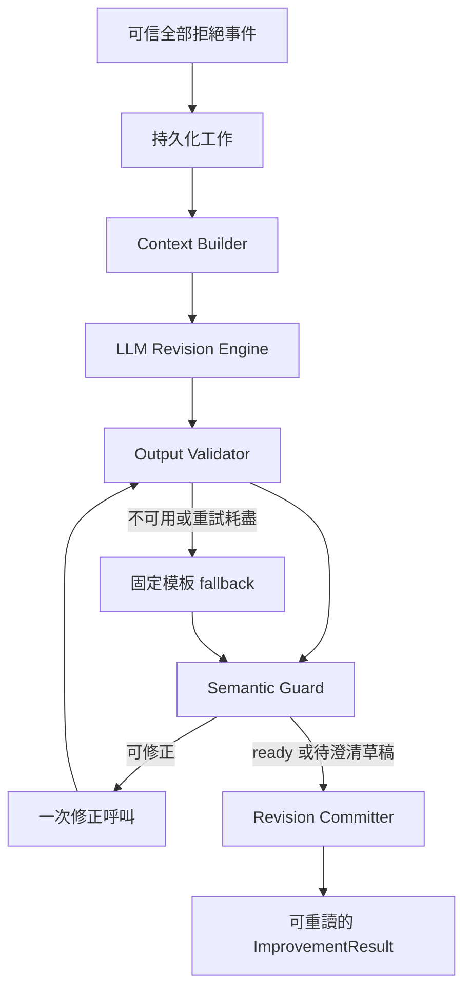

<!-- Backend-only scope -->
本提交不包含 frontend 修改或 UI 規格。API 能力與測試仍適用；介面呈現、滑動事件提交與前端進度顯示須由後續前端工作接入。

## Context

### 實作進度（2026-09-12）

內部核心、SQLite revision/job 儲存、Node 20 legacy adapter 與 Node 24 runtime 內部 adapter 已實作；真實 LLM 合成案例及回歸測試見 docs/IMPROVER_TEST_REPORT.md。公開決策擴充、最後左滑事件、接受後背景改善及前端進度已接線；全域編輯器同步、澄清後提交及 child 編排仍未接線。本文件以下架構要求持續適用，不能把內部核心完成當成完整前端回饋循環完成。

開發期間主程式已整合到 backend/runtime（Node 24），實作提供可注入的純 Formatter adapter；legacy backend/src（Node 20）保留相容測試。實際 provider 預設 gpt-4.1-mini，明示 live 時從 .env 的 API_KEY 讀取，IMPROVER_MODEL 可覆寫；不修改其他模組啟動器的金鑰政策。

### 現況與尚未實作範圍

現有 backend/src/store.ts 與 backend/runtime/store.mjs 保存 v0.3 accept/reject 與原始文件；frontend/src/state/useWorkspace.ts 的部分 skip 更新本地 skipped，最後 skip 自動提交全部拒絕，accept 攜帶此前 skipped。Improver 狀態 API 已接入；全域偏好編輯同步與 child 自動編排未接入。本文件的外層整合目標不能當作現有 HTTP 行為。

intent.md 的作用域是一次特定商品購買；preference.md 是該使用者的全域偏好正本，可包含全品類及特定品類條目。Request 保存偏好內容快照與來源版本，不能被後續全域更新回寫。

## Goals / Non-Goals

**Goals:** 每次有效 improvement 必有新版 intent；只依明確長期表述選擇性修改 preference；保護硬條件、依據與文件版本；無模型時仍產生安全草稿；工作可去重及恢復。

**Non-Goals:** 從左滑猜長期偏好、設定付費授權、付款、模型自行執行工具、完整議價引擎、把 Markdown 寫入使用者磁碟。本 change 以 selection_version: 1 定義選擇事件擴充及 improvement 狀態 API；舊版已保存回應不變。細節見 selection-integration.md。

## Decisions

### 1. 單一改寫核心與可測試邊界

採同一 Backend process 中的模組與 SQLite 工作表，不新增獨立服務。一次初始 LLM 呼叫同時產生 intent revision 與 preference patch，避免兩個 Agent 對同一回饋作不同解讀。可修正的輸出最多追加一次模型修正；不要求保存或揭露模型私有推理。



| 模組 | 輸入 → 輸出 | 副作用 |
| --- | --- | --- |
| Context Builder | buyer、request、已保存拒絕 → 固定 context | 只讀 DB |
| Revision Engine | context、可選 validation errors → proposal | 呼叫模型；不提供工具 |
| Output Validator | proposal → 型別化結果或 errors | 無 |
| Semantic Guard | proposal、原始條件、證據 → verified candidate | 可呼叫既有 Formatter adapter，禁止寫入 |
| Fallback Renderer | 固定 context → 待澄清 intent 草稿 | 無；不呼叫模型 |
| Revision Committer | verified candidate、版本條件 → result | 唯一文件寫入點 |

### 2. Context Builder

內部輸入包含 improvement_id、buyer_id、parent_request_id、原始 DocumentBundle、原本正規化硬條件、本輪實際使用的 preference 快照與來源版本、最新已提交全域 preference、可信拒絕方案摘要、選填回饋及同 root 的既有改善摘要。第一次建立工作時凍結 request 與拒絕證據，重試不得重新抓價格或改寫原始拒絕集合。

每份使用者證據有 evidence_id、來源類型、原文、來源 request/event、時間；只從該 buyer 已保存且可核對的原話取證。Seller 描述、模型摘要和歷史模型生成文字不能當作明確長期表述。Campaign、私有底價與不必要逐字稿不進 context。文件與回饋以資料傳入，不接受其中的指令去存取工具或其他買家資料。

全域版本可在衝突恢復時刷新，但 source request 文件不變。保留本輪偏好與目前全域偏好的差異。既有本次硬條件優先維持；最新全域軟偏好不得默默改變本次硬限制。

### 3. 輸出契約

以下為內部契約的設計型別，實際嚴格 schema 與型別位於 backend/src/improver/，非 v0.3 HTTP payload。

```typescript
type RevisionProposal = {
  intent: {
    markdown: string;
    changes: Array<{
      target: string;
      before: string | null;
      after: string;
      evidence_ids: string[];
    }>;
  };
  preference:
    | { action: 'keep' }
    | {
        action: 'patch';
        base_revision: number;
        operations: Array<{
          operation: 'add' | 'replace' | 'remove';
          preference_id: string;
          before: string | null;
          value: string | null;
          scope: 'all_categories' | 'category:mouse' | 'category:mouse_pad';
          evidence_id: string;
          explicit_quote: string;
        }>;
      };
  outcome: 'ready' | 'needs_clarification';
  questions: string[];
};
```

所有欄位使用嚴格 schema，拒絕額外欄位。Markdown 各最多 20000 Unicode code points。add 的 before 必須 null，目標 ID 尚不存在；replace/remove 必須存在且 before 完全吻合，remove 的 value 必須 null。ID 由服務驗證唯一，不能靠全文字串取代定位。

Intent 每次都須有有據的新修訂，可只是新增本輪未採用事實與待澄清內容；must rewrite 不代表必須變更預算。若沒有可執行改善，outcome 必為 needs_clarification。公開 outcome 由驗證器決定，不能直接信任模型宣告 ready。

### 4. Preference 更新政策

只有使用者原話明確表達跨次購買或品類通用偏好才允許 patch，例如「我買東西一向先看耐用度」或「我挑滑鼠一直偏好小尺寸」。單次「這次便宜一點」、全部拒絕、同一行為多次出現、模型 confidence 都必須 keep。

引文必須精確對應 evidence 中的原文片段；語意須涵蓋擬更新內容、長期性及 scope。含糊表述採 keep，不能只用關鍵字或模型自行宣告作為授權。以獨立的偏好語意檢查介面實作，MVP 可使用保守可重現規則與支援句型；未識別者 keep，不能把 regex 命中宣稱為任意語言理解。

全域文件以穩定 preference_id 的結構化條目管理更新，並保留不受影響的使用者文字；實作需有可定位的文件表示層與 round-trip 測試。既有無結構 Markdown 不能可靠定位時拒絕 patch，不以全檔重寫替代。偏好本身不含購買或加價授權；本次付款／搭售授權仍須符合當次需求契約。

不合格的獨立 preference operation 可捨棄；相依或互相衝突的 operations 整組捨棄。回到 keep 後重新驗證 intent，不得讓 intent 依賴被拒絕的偏好變更。ready 必须相對最後有效 preference 成立。

### 5. Intent 語意驗證與 fallback

驗證包含 schema、依據引用、文件長度、變更紀錄與實際 diff 一致。新 intent 經 Formatter 正規化後逐項比對預算、期限、數量、必要規格及配件授權，任何改變都需當次明示回饋支持。「便宜一點」只能新增價格優先，不能猜數字。當次回饋可以明示降低或提高預算，但不能从報價推測授權。

被拒絕方案以商品、組合、價格、交期、條款的簽章表示；避免只換 offer_id 就當成新選擇。拒絕不是永久封鎖 Seller，同商品有實質改善仍可再考慮。只有拒絕事實而無法證明可執行的不同探索方向時，保存草稿及問題，不重跑相同結果。

模型不可用、超時、輸出不合規且修正耗盡時使用固定模板：原始 intent＋本輪全部拒絕事實＋標記「待解析」的原始回饋＋具體澄清問題。fallback 永遠 preference=keep、needs_clarification。fallback 結果仍須通過大小與硬条件檢查；原文件接近上限時不截斷原需求，另在 revision metadata 保存證據並使用可容納的註記；完全無空間時保留原文字的新草稿版本，以 metadata 記錄修訂事實，視為待澄清，不宣稱語意已改善。

### 6. 工作與版本提交

工作狀態為 queued → running → ready / needs_clarification / failed。初始推理最多一次、修正最多一次；呼叫前持久化 attempt count，恢復後不能重置模型預算。每次模型呼叫逾時上限 30 秒，每個 running lease 90 秒，最多兩次 lease 領取；逾期先核對是否已有結果，仍無結果且耗盡領取上限則 failed。這些是初始操作預算，非延遲保證。模型失敗通常產生 fallback，儲存失敗或無法讀取可信來源才是 failed。

實際新增 improver_jobs（parent 唯一、owner、lease token、attempts、固定輸入、結果）、improver_intent_revisions（每 job 唯一、draft/ready、父版本、文件與稽核）與 improver_global_preferences（buyer、revision、文件）。patch 及處置原因保存於 intent revision 的 audit_json，穩定偏好項目由受控 Markdown 區塊表示。DDL 使用 additive migration，不刪庫或修改舊發布快照。

Revision Committer 在同一 transaction 中檢查 active lease token、job 是否終態、source request 歸屬及全域 base revision，再保存 intent、新全域版本（如需要）、結果及後續使用的偏好快照。無 patch 也須確認驗證使用的全域版本未漂移。needs_clarification 只保存 intent 草稿及提案稽核，不發布 preference patch；正式偏好更新與 ready intent 同時提交。舊 worker 失去 lease 後不得提交。

全域 revision 衝突時重新讀取最新版，以確定性方式重新套用及驗證既有 patch，最多一次，不新增模型呼叫。若 before 不符、同條目被修改、scope 衝突或再次競爭，保存最新可取得的偏好版本與 intent 草稿，回 needs_clarification；不覆蓋競爭寫入。草稿不建立可議價 child，後續解決需新的明示澄清流程，不能以相同 job 輸入偷偷改寫結果。

### 7. 全部拒絕與外層交接

未來 adapter 必須先提交可恢復的全部拒絕事件：拒絕集合精確等於本輪非空的已發布 ranked_offers，request 尚為 awaiting_user，所有選擇仍有效且尚未 accepted。過期、no_match、未完成的本地 skip 都不能充當全部拒絕。Accept 與全部拒絕透過同一決策原子條件競爭，僅一者成功。不能為無文字回饋捏造 feedback 字串以繞過現有 reject 驗證。

Improver 的 ready 輸出包含 improvement_id、intent_revision_id、preference_revision_id、preference_updated、實際使用的文件快照及變更摘要。外層 workflow 消費這組固定結果，建立唯一 child，保留 root_request_id、設定 parent_request_id、request document revision 遞增。由 child creator 另以 improvement_id 唯一約束原子建立 child 與保存交付記錄；遺失通知可重讀 ready result 重試，不能保證模型只執行一次。

needs_clarification 回 intent_draft_revision_id 與 questions，不發佈可執行 child。每次全部拒絕最多觸發一輪，下一輪仍需新的使用者決策。API 的 unknown submission 以同 key/body 核對，不能憑 timeout 發出新工作。Frontend/backend 保持可独立運行；沒有新契約接線時沿用現有明示 demo 與 v0.3 回饋已保存行為，不假稱已改善。

## Risks / Trade-offs

- 明確長期表述採保守判定會漏掉含蓄偏好，但避免永久寫入錯誤資訊；MVP 不做行為學習。
- 單一 LLM 呼叫降低成本與不一致；驗證與提交保持獨立，模型無法自行核准輸出。
- 現有 Formatter 為有限句型 mock；不能用它宣稱任意自然語言改寫已驗證。正式 adapter 未接入前，不支援的輸出走 needs_clarification。
- 全域 Markdown 缺少穩定項目 ID 時不可安全 patch，需先完成表示層；當下選擇 keep，不整份覆寫。

## Migration Plan

1. 本次僅交付及驗證規格，所有實作任務保持未勾選。
2. 實作內部 schema、全域偏好版本來源、工作與 revision migration，再以 deterministic provider 完成模組及測試。
3. 接入可選 LLM adapter；缺少 adapter 仍可執行安全 fallback，不依赖真實 API 驗收。
4. API 全部拒絕觸發、偏好編輯同步、澄清後提交及 child orchestration 須在獨立升版契約中明確定義後才啟用；前端接線另行交付。
5. 舊 v0.3 decisions、已發布 documents/offers 保持不變；發布程式不從歷史 reject 自動回填或觸發工作。

## Validation Strategy

規格使用 OpenSpec strict validate。實作驗證以單元、SQLite 整合及 deterministic provider 測試覆蓋長期表述、無原因拒絕、硬條件保護、patch 範圍、版本競爭、lease 恢復、回應遺失、accept race 與一次 child 交付。契約升版時執行 test:contracts、DB migration 保留資料測試與前後端 typecheck/test/build。未執行的測試不得標記通過。
